# AI Portfolio Advisor

*Calibrated 21-day return ranges for NSE large caps, explained and sized to an investor's risk profile*

**Capstone project report** · AI and ML for Digital Business Managers  ·  Applied AI & Machine Learning Capstone

**Team (Group 5):** B Gokul Vaigundh (DBM/1015/03); Balaji G (DBM/1016/03); Shashaanth NC (DBM/1070/03)

**Live app:** https://fn.iimbg.com · **Landing page:** https://fin.iimbg.com · **Code:** https://github.com/build-with-bala/ai-portfolio-advisor

*Generated by `scripts/build_report.py` from `reports/metrics.json` (2026-10-08 23:12). Word version: [Capstone_Report.docx](Capstone_Report.docx).*

> AI Portfolio Advisor is a research and education tool. It is not investment advice, its authors are not registered investment advisers, and it places no trades.

## Contents

- Executive summary
- 1. Business problem and users
- 2. The product in use
- 3. Business value and return on investment
- 4. System architecture and repository
- 5. Data
- 6. Feature engineering
- 7. Feature selection
- 8. Modelling
- 9. Validation design
- 10. Hyperparameter optimisation
- 11. Results
- 12. Explainability
- 13. Error analysis
- 14. The decision engine
- 15. Engineering and reproducibility
- 16. Limitations, risks, ethics and next steps
- References
- Appendix A. Technical-defence questions and answers
- Appendix B. All hyperparameter trials
- Appendix C. Glossary

## Executive summary

**The problem.** Independent wealth advisers and self-directed investors in India usually choose stocks from tips, broker notes and single price targets. A single target hides the two things a client most needs to know: how wide the range of likely outcomes is, and whether the position fits the client's tolerance for risk. Screening 60 large companies by hand before each client review is also slow.

**The product.** AI Portfolio Advisor is a web application, live at https://fn.iimbg.com. The user sets a risk profile (Conservative, Moderate or Aggressive) and an amount of capital. The application returns a ranked book of 60 National Stock Exchange (NSE) large caps, each marked STRONG BUY, BUY, WATCH or PASS, with a pessimistic, median and optimistic return for the next 21 trading days, the evidence behind the rating, the model's reasons for that stock, and a position size in whole shares. No programming or statistics is needed to use it.

**The business case.** For an adviser with 200 clients reviewed 4 times a year, cutting screening time from 45 to 10 minutes per review frees 467 hours a year. At Rs 1,500 an hour that is worth Rs 7.0 lakh, against an assumed running cost of Rs 1.2 lakh: a return of 483% on cost. These inputs are assumptions, stated openly and tested in a sensitivity table; they are not measurements.

**The machine learning.** Three LightGBM quantile-regression models forecast the 10th, 50th and 90th percentile of each stock's 21-day return from 10 price-and-volume features, selected from 19 candidates by a mutual-information method. Settings were chosen by a random search over 25 configurations, each scored by purged walk-forward cross-validation on 5 folds (375 model fits). The most recent 20% of dates were locked away as a hold-out test. SHAP values explain every forecast.

**What the evidence shows.** Tuning cut the pinball loss (the error measure for quantile forecasts) by 9.2% compared with the settings in our original notebook. On the hold-out period, 82.4% of real outcomes fell inside the model's P10 to P90 band against a target of 80%: the risk ranges are honest. However, the tuned model only ties a naive baseline that ignores all features (0.02406 against 0.02395 in cross-validation), and a strategy that buys the five highest forecasts did **not** beat holding all 60 stocks equally on the hold-out period (-4.4% a year against +3.3%).

**What we therefore claim.** The product saves screening time, enforces a consistent risk discipline, and gives clients a calibrated range of outcomes with a plain-language explanation. It does not claim to pick winning stocks, and this report says so wherever the question arises. It is a research and education tool, not investment advice.

> **How to read this report.** Sections 1 to 3 are written for a business reader. Sections 4 to 15 document the pipeline and every modelling choice. Section 16 states the limits. Appendix A lists the questions an examiner could ask any team member, with answers. Every number comes from `reports/metrics.json` (generated 2026-10-08 23:12) or is labelled an assumption.

## 1. Business problem and users

### 1.1 The problem

A retail investor who asks "should I buy this stock?" is normally given a point answer: a target price, a star rating or a tip. Three things are missing from that answer. First, uncertainty: a forecast of +2% over a month means little unless the client also knows that the plausible range runs from, say, −7% to +11%. Second, fit: the same stock can be reasonable for a 30-year-old with a long horizon and wrong for a retiree who cannot tolerate a 30% fall. Third, reasons: an adviser who cannot explain why a name is on the list cannot defend it to a client or to a compliance reviewer.

For the adviser the problem is also one of time. Before a client review the adviser has to look at price trends, valuation ratios, recent volatility and sector exposure for dozens of companies, and then translate that into a short list and position sizes that respect the client's risk limits. Done by hand, with a charting site and a spreadsheet, this is slow and inconsistent: two clients with the same profile can receive different advice on different days.

### 1.2 Target persona

The primary user is an **independent wealth adviser** or a small advisory practice serving a few hundred retail clients, who reviews each client's equity holdings a few times a year. This user is financially literate but is not a data scientist and will not read code. The secondary user is a **self-directed investor** who reviews a portfolio about once a month and wants a disciplined second opinion. The forecast horizon of 21 trading days (about one calendar month) was chosen to match that monthly review cycle.

### 1.3 Scope

The scope is deliberately narrow so that it can be validated properly: 60 liquid NSE large caps, five from each of 12 sectors, daily data, one forecast horizon, long-only positions, and no order execution. The product produces research output for a human to review. It never connects to a brokerage account to place trades.

## 2. The product in use

The application is a single Streamlit web page (https://fn.iimbg.com). Streamlit is a Python framework that turns a script into an interactive web application, so the whole product, interface included, is Python. A user works from left to right: set the profile in the sidebar, read the summary strip, then open the tabs for detail.

### 2.1 Profile intake

The sidebar holds a short form. The user picks a risk posture (Conservative, Moderate or Aggressive), enters investable capital and the maximum number of holdings, and may adjust seven limits that the posture pre-fills: minimum forecast confidence, minimum expected 21-day return, maximum annual volatility, maximum trailing drawdown, maximum weight of any one position, minimum fundamental score, and sector or ticker exclusions. Pressing "Run profile analysis" recomputes everything. A non-technical user can ignore the sliders entirely: choosing the posture and typing the capital is enough.

### 2.2 Summary strip and automated insights

Six headline cards sit above the tabs: number of positions, the portfolio's base-case 21-day return (model median), its bear case (10th percentile), trailing annual volatility, the share of capital invested, and the average fundamental score. Below them, an "Automated insights" panel writes two or three sentences about the strongest names in plain language.

### 2.3 The seven tabs

**Table 1. What each tab of the application shows**

| Tab | What the user sees | Decision it supports |
|---|---|---|
| Overview | The recommendation book: every eligible stock with its rating, overall score, P10 / P50 / P90 return, confidence and target shares; decision cards; an evidence ledger with technical and fundamental readings and risk flags; near misses; a CSV download. | Which names to discuss with the client, and why. |
| Stock research | For any one ticker: candlestick chart with moving averages, Bollinger bands, volume, RSI and MACD; indicator readings; fundamental snapshot; the stock's own SHAP drivers. | Whether a single recommendation survives a closer look. |
| Portfolio lab | Capital map (weights and cash), bear / base / bull portfolio scenario, sector exposure, and an illustrative staged order schedule in whole shares. | How much to hold of each name. |
| Validation | Hold-out error, directional accuracy, rank IC, band coverage, and the realised return that followed each signal. | How far to trust the forecasts. |
| Model report | The full evidence in this report: cross-validation candidates, all hyperparameter trials, fold dates, hold-out test, backtest, SHAP, feature selection, error analysis and leakage controls. | Technical audit of the model. |
| India live | Optional intraday quotes through an Upstox or Zerodha exchange feed (or a delayed public fallback), shown as a separate overlay. | Whether today's price action contradicts the daily forecast. |
| Method & data | The decision pipeline in five steps, data coverage, and missing-data rates. | What the tool does and does not use. |

A floating "Ask the analyst" chat button lets the user ask questions in ordinary language (for example, "which banks have the narrowest forecast range?"). It is a large language model that is given the current table of all stocks as context and told to answer only from it; it is enabled only when an API key is configured and is not part of the validated forecast.

### 2.4 Design choices that serve a non-technical user

Four choices were made for usability. Ratings use four familiar words instead of scores. Every forecast is shown as a range, never a single number. When no stock passes the user's limits the application says so and shows the near misses, instead of quietly relaxing the limits. And every screen that could be mistaken for advice carries the statement that the output is research only and that no broker connection or automatic order execution is enabled.

## 3. Business value and return on investment

### 3.1 Where the value comes from

The product creates value in three ways, and it is important to be exact about which of them is supported by evidence. **Time.** Screening, ranking, sizing and writing up the reasons are automated; the adviser reviews a prepared book instead of building one. **Discipline.** The same profile always produces the same book on the same day, every exclusion is visible, and position sizes follow a stated rule. **Risk communication.** The client is shown a range whose reliability has been measured on unseen data. The product does *not* create value by selecting stocks that outperform; Section 11 shows that the evidence does not support that claim.

### 3.2 The quantified case: adviser time saved

The return-on-investment (ROI) case is built on five inputs, all of them assumptions chosen to describe a mid-sized independent practice (Table 2). With 200 clients and 4 reviews each a year there are 800 reviews. Saving 35 minutes on each gives 800 × 35 ÷ 60 = 467 hours a year. Valued at Rs 1,500 an hour this is Rs 700,000 (Rs 7.0 lakh). After an assumed running cost of Rs 120,000 the net benefit is Rs 580,000, and ROI = net benefit ÷ cost = 483%.

**Table 2. ROI inputs. All five are assumptions, not measurements**

| Input | Value | Basis | How the team would verify it |
|---|---|---|---|
| Clients per adviser | 200 | Assumed size of a mid-sized independent practice | Ask pilot advisers for their client count |
| Reviews per client per year | 4 | Assumed quarterly review cycle | Adviser calendar |
| Screening time per review, today | 45 min | Assumed; manual charting and spreadsheet work | Time-and-motion study on 20 reviews |
| Screening time per review, with the product | 10 min | Assumed; reading a prepared book | Same study, with the application |
| Value of adviser time | Rs 1,500 / hour | Assumed billing-equivalent rate | Practice revenue ÷ adviser hours |
| Annual running cost | Rs 120,000 | Assumed: hosting, data and maintenance | Actual hosting and data invoices |

### 3.3 Sensitivity

Because the inputs are assumed, the conclusion should not depend on any one of them. Table 3 recomputes ROI for smaller and larger practices and for smaller and larger time savings, holding the hourly rate and running cost fixed. Figure 1 shows the same calculation as net benefit in rupees. Two points stand out. The case is robust for a practice of 200 clients: even if the product saved only 15 minutes per review, less than half the base assumption, ROI would still be 150%. But the case is weak for a very small practice: with the base saving of 35 minutes, break-even needs about 34 clients, and with 50 clients and a 15-minute saving the product would lose money (-38%).

**Table 3. ROI on cost by practice size and minutes saved per review (rate Rs 1,500/hour, cost Rs 1.2 lakh/year; base case in bold)**

| Clients | 15 min saved | 25 min saved | 35 min saved | 45 min saved | Hours saved (base) |
|---|---:|---:|---:|---:|---:|
| 50 | -38% | 4% | 46% | 88% | 117 |
| 100 | 25% | 108% | 192% | 275% | 233 |
| 200 | 150% | 317% | **483%** | 650% | 467 |
| 300 | 275% | 525% | 775% | 1025% | 700 |
| 400 | 400% | 733% | 1067% | 1400% | 933 |

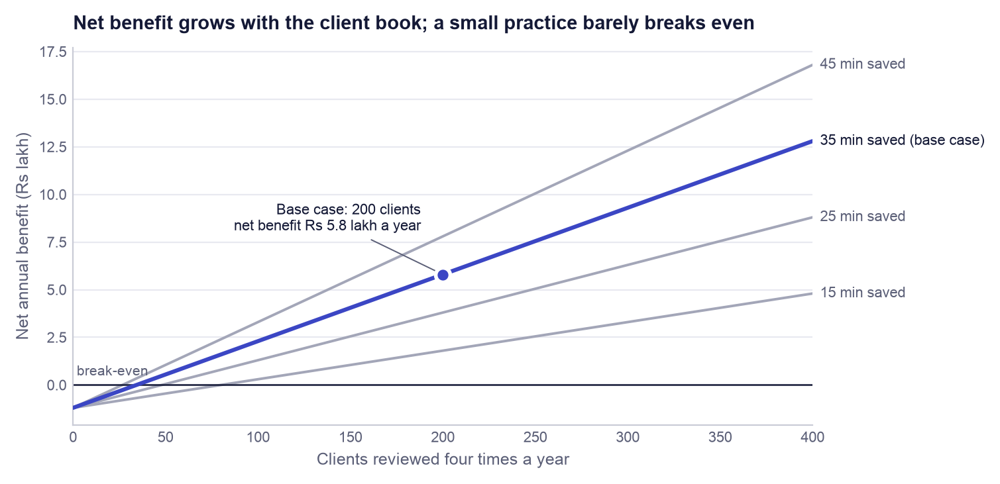

*Figure 1. Net annual benefit against number of clients for four levels of time saved per review. Hourly rate (Rs 1,500) and running cost (Rs 1.2 lakh) are held at the base assumptions.*

> **Measured versus assumed.** **Measured** (from the hold-out test in this repository): forecast-band coverage of 82.4% against an 80% target; pinball loss, error and rank IC in Section 11; the backtest result. **Assumed** (not observed): every input in Table 2, and therefore the 467 hours, the Rs 7.0 lakh and the 483%. **Not claimed:** any improvement in investment returns.

### 3.4 Market strategy

The proposed route to market has three steps. The self-directed investor gets the research tool free, which builds an audience and a body of user feedback. The adviser pays for a seat, because the adviser is the user for whom saved hours convert directly into money and who needs client-ready evidence sheets (the CSV export and the evidence ledger). Brokers are a distribution channel and not a customer in the first phase: the application already contains adapters for the Upstox and Zerodha market-data feeds, so it can sit beside an existing brokerage login. This strategy is a proposal. No pricing test, customer interview programme or pilot has been run, and none is claimed.

## 4. System architecture and repository

The system has two halves that meet at a small set of files (Figure 2). The **training pipeline** runs offline, on demand, and takes about a minute. The **product** reads what the pipeline wrote and never trains anything. Keeping them apart means the web application cannot change the model by accident, and the numbers a user sees are exactly the numbers that were validated.

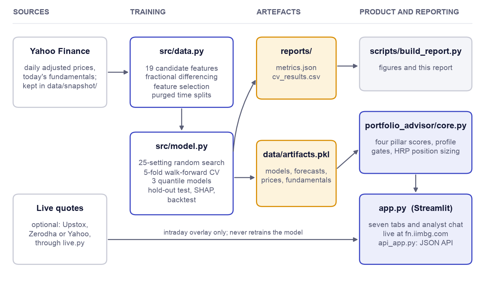

*Figure 2. System architecture. Training (centre) turns the committed data snapshot into two artefacts: a report of every metric and a bundle of fitted models. The product (right) reads the bundle; this report is generated from the metrics file.*

`src/data.py` holds everything about data: the universe, the download and snapshot functions, the technical indicators, fractional differencing, the feature-selection routine and the time-series split functions. `src/model.py` holds everything about learning: the loss function and metrics, the quantile models, the random search, the baselines, the hold-out evaluation, the backtest, SHAP and the error analysis; its `train()` function writes the artefacts. `src/portfolio_advisor/core.py` is the decision engine that converts forecasts into ratings and position sizes (Section 14). `app.py` is the Streamlit interface and `api_app.py` exposes the same engine as a JSON web service for other software.

**Table 4. Repository layout**

| Path | Role |
|---|---|
| `src/data.py` | Universe, price download and snapshot, 19 candidate features, fractional differencing, feature selection, purged time-series splits |
| `src/model.py` | Pinball loss and metrics, random search, walk-forward cross-validation, baselines, final quantile models, hold-out test, backtest, SHAP, error analysis, export |
| `app.py` | Streamlit product: profile intake, seven tabs, analyst chat |
| `requirements.txt`, `pyproject.toml` | Pinned dependency ranges; Python 3.11 to 3.13 |
| `src/portfolio_advisor/core.py` | Decision engine: pillar scores, profile gates, ratings, HRP sizing, whole-share allocation |
| `src/portfolio_advisor/live.py`, `chat.py` | Optional live-quote adapters (Upstox, Zerodha, Yahoo) and the grounded chat client |
| `api_app.py` | Optional FastAPI service exposing the same engine as JSON endpoints |
| `data/snapshot/` | Committed prices and fundamentals, so that training is reproducible without a network connection |
| `reports/metrics.json`, `reports/cv_results.csv` | Every number in this report; one row per trial and fold |
| `tests/` | 22 automated tests, including the leakage checks |
| `scripts/build_report.py` | Generates this report and its figures from the two files in `reports/` |
| `docs/` | This report, the slide deck, and the vibe coding log |
| `Dockerfile`, `docker-compose.yml`, `.github/workflows/ci.yml` | Container images, two-service deployment, and continuous integration |

## 5. Data

### 5.1 Universe, period and source

The universe is 60 NSE-listed large caps, five from each of 12 sectors (Table 5). Fixing five per sector stops the model from learning mainly about banks and information-technology companies, which dominate Indian indices by weight. Prices are daily open, high, low, close and volume from Yahoo Finance through the `yfinance` library, adjusted for splits and dividends, downloaded from 2017-01-01. After the indicators have enough history to be computed, the usable panel runs from 2018-02-19 to 2026-10-08 and contains 118,641 rows, where one row is one stock on one trading day. The downloaded data are committed to the repository as a compressed snapshot, so anyone who clones the repository trains on exactly the same data.

**Table 5. The 60-stock universe by sector (NSE tickers)**

| Sector | Tickers |
|---|---|
| Banks & NBFC | HDFCBANK, ICICIBANK, SBIN, AXISBANK, KOTAKBANK |
| IT Services | TCS, INFY, HCLTECH, WIPRO, TECHM |
| Oil, Gas & Energy | RELIANCE, ONGC, BPCL, IOC, GAIL |
| FMCG | ITC, HINDUNILVR, NESTLEIND, BRITANNIA, DABUR |
| Automobiles | MARUTI, M&M, BAJAJ-AUTO, HEROMOTOCO, EICHERMOT |
| Pharma & Healthcare | SUNPHARMA, CIPLA, DRREDDY, DIVISLAB, APOLLOHOSP |
| Capital Goods & Defence | LT, ABB, SIEMENS, BEL, HAL |
| Metals & Mining | TATASTEEL, HINDALCO, JSWSTEEL, COALINDIA, VEDL |
| Utilities & Power | NTPC, POWERGRID, TATAPOWER, JSWENERGY, TORNTPOWER |
| Consumer Discretionary & Retail | TITAN, TRENT, DMART, JUBLFOOD, ETERNAL |
| Chemicals | PIDILITIND, SRF, UPL, PIIND, DEEPAKNTR |
| Real Estate & Construction | DLF, GODREJPROP, OBEROIRLTY, PRESTIGE, PHOENIXLTD |

### 5.2 The label

The quantity to be predicted, the label, is the **forward return**: the percentage change in the adjusted close from day *t* to day *t* + 21 trading days. It is a continuous number, so the task is regression, and it is defined for every row except the most recent 21 days, whose future is not yet known. Those 1,260 newest rows are kept so that the application can score today's market, and they are never used for training or for any metric.

### 5.3 Cleaning and preprocessing

Four steps prepare the data. (1) Tickers with fewer than 250 days of prices are dropped at download. (2) Infinite values produced by divisions (for example a zero 14-day range) are converted to missing. (3) Rows missing any of the 19 candidate features are dropped; these are almost entirely the warm-up period at the start of each stock's history, when a 252-day high or a fractional difference cannot yet be computed. No values are imputed, because inventing a price indicator would add noise where we can simply wait for data. (4) Every feature is a return, a ratio or a bounded oscillator, so a stock trading at Rs 300 and one at Rs 30,000 are directly comparable without any rescaling of price levels.

### 5.4 How the rows are divided

The dates are divided once, by time, before any modelling (Table 6). The earliest 80% of dates are the **development set**, used for feature selection, tuning and cross-validation. The latest 20% are the **hold-out set**, used once for the final test. The 31 trading days immediately before the hold-out are discarded so that no development label can reach into the hold-out period (Section 9 explains why).

**Table 6. How the panel is divided**

| Part | Dates | Rows | Used for |
|---|---|---:|---|
| Development | 2018-02-19 to 2024-12-09 | 91,108 | Feature selection, tuning, cross-validation, final fit |
| Purged gap | 31 trading days | 1,860 | Discarded |
| Hold-out, scored | 2025-01-23 to 2026-09-09 | 24,413 | Final test, SHAP, error analysis, backtest |
| Latest, no label yet | last 21 trading days to 2026-10-08 | 1,260 | Live forecasts in the application only |
| Total |  | 118,641 |  |

### 5.5 Survivorship bias

The universe was chosen in 2026 from companies that are large today. Companies that were large in 2018 and later shrank, merged or were delisted are absent, and companies that grew into large caps are included for their whole history. This is survivorship bias. It flatters any historical return figure for the universe as a whole, which is one reason the backtest benchmark is the same 60 stocks held equally and not an outside index: both the strategy and the benchmark carry the same bias, so their difference is a fairer measure than either level.

## 6. Feature engineering

A feature is an input column the model can use. All 19 candidates are computed only from prices and volumes up to and including day *t*, so each is known at the moment a forecast would be made. Sixteen describe the individual stock and three describe the market as a whole on that day (Table 7). The market features are simple cross-sectional averages over the 60 stocks; they let the model behave differently in calm and turbulent markets.

**Table 7. The 19 candidate features**

| Feature | How it is computed | What it measures | Kept |
|---|---|---|---|
| `RSI_14` | Relative Strength Index over 14 days: 100 − 100 / (1 + average gain / average loss), with exponential (Wilder) smoothing | Whether recent gains have outweighed recent losses (0 to 100) | No |
| `MACD_signal` | MACD histogram (12-day minus 26-day exponential average, less its own 9-day average), divided by price | Whether the short-term trend is accelerating or fading | No |
| `Boll_BW` | Bollinger band width: 4 × 20-day standard deviation of price ÷ 20-day average price | How wide the recent trading range is | Yes |
| `ATR_14` | Average True Range over 14 days ÷ price | Typical daily price range, including overnight gaps | No |
| `Stoch_K` | Stochastic %K: 100 × (close − 14-day low) ÷ (14-day high − 14-day low) | Where today's close sits inside the 14-day range | Yes |
| `OBV_delta` | 5-day percentage change in on-balance volume (running sum of volume, signed by the day's price direction), clipped to ±5 | Whether volume is flowing into up days or down days | Yes |
| `Williams_R` | −100 × (14-day high − close) ÷ (14-day high − 14-day low) | The same position-in-range reading as Stoch_K, shifted by 100 | No |
| `ret_5` | Price change over the last 5 trading days | One-week momentum or reversal | No |
| `ret_21` | Price change over the last 21 trading days | One-month momentum | No |
| `vol_21` | Standard deviation of daily returns over 21 days | Recent stock-level risk | No |
| `fracdiff_close` | Log price, fractionally differenced with the smallest order d that passes the ADF test | The price trend with its long memory kept but its drift removed | Yes |
| `ret_63` | Price change over the last 63 trading days | One-quarter momentum | Yes |
| `mom_126_21` | Price 21 days ago ÷ price 126 days ago − 1 | Six-month momentum that skips the most recent month | Yes |
| `vol_63` | Standard deviation of daily returns over 63 days | Slower-moving stock-level risk | Yes |
| `dist_52w_high` | Close ÷ highest close of the last 252 days − 1 | How far the stock is below its one-year high | No |
| `volume_surge` | 5-day average volume ÷ 60-day average volume − 1 | Unusual trading activity | Yes |
| `rel_ret_21` | ret_21 minus the average ret_21 of all stocks that day | One-month performance relative to the market | Yes |
| `mkt_ret_21` | Average ret_21 across all stocks that day | Direction of the whole market over the last month | No |
| `mkt_vol_21` | Average vol_21 across all stocks that day | How turbulent the whole market is | Yes |

### 6.1 Why prices cannot be used directly: stationarity

A share price trends. Its average level in 2019 is different from its average level in 2025, so a rule learned at one price level does not transfer to another. Statisticians call a series **stationary** when its mean and variance do not drift over time, and most learning algorithms implicitly assume their inputs are stationary. The usual cure is to take the day-to-day change (first difference, or return). That makes the series stationary but throws away almost all of its memory: a return says nothing about whether the stock is high or low relative to its own past.

### 6.2 Fractional differencing from first principles

Ordinary differencing computes x(t) − x(t−1): a weight of 1 on today and −1 on yesterday. Fractional differencing generalises this to an order *d* between 0 and 1. The weights come from the binomial series: the first is 1, and each later weight is the previous one multiplied by −(d − k + 1) ÷ k. For d = 1 the sequence is 1, −1, 0, 0, … which is the ordinary difference; a unit test in the repository confirms this. For d = 0.4 the sequence is 1, −0.40, −0.12, −0.064, … and decays slowly, so the result still depends on prices from many weeks back. The smaller *d* is, the more memory survives; the larger it is, the more of the trend is removed. The code stops adding weights once they fall below 0.0001 in absolute size.

The right *d* is the smallest one that makes the series stationary. To decide, the pipeline uses the **Augmented Dickey-Fuller (ADF) test**. Its null hypothesis is that the series has a unit root, meaning that shocks never fade and the series wanders without a fixed mean. A p-value below 0.05 rejects that hypothesis. For each stock the pipeline tries d = 0, 0.1, 0.2, … 1.0 on the log price and keeps the first value that passes; the resulting series is the feature `fracdiff_close`. Crucially, *d* is chosen using development-period prices only (the `fit_until` argument in `stock_features`), so the hold-out period has no influence on how the feature is built. This technique follows López de Prado (2018).

## 7. Feature selection

### 7.1 Why select at all

Many technical indicators are different arithmetic on the same information. The clearest case in our list is `Williams_R`, which is exactly `Stoch_K` minus 100. Feeding near-duplicates to a model adds no information, makes importance scores harder to read because credit is split between twins, and gives a flexible model more ways to fit noise. Selection therefore aims for a small set in which each feature says something the others do not.

### 7.2 The method: relevance minus redundancy

**Mutual information** between two variables measures how much knowing one reduces uncertainty about the other. It is zero when they are independent and, unlike correlation, it also detects non-linear relationships (for example, "very high and very low volatility both precede large moves"). The pipeline uses scikit-learn's nearest-neighbour estimator, which reports the value in natural units (nats).

Selection is greedy. Step 1 picks the feature with the highest mutual information with the label (its *relevance*). Every later step scores each remaining feature as relevance minus 0.5 times its *redundancy*, where redundancy is its average mutual information with the features already chosen, and adds the best one. This repeats until 10 features are chosen. The idea is that of the minimum-redundancy maximum-relevance method of Peng, Long and Ding (2005). The calculation runs on a random sample of 20,000 development rows; the hold-out period is never seen.

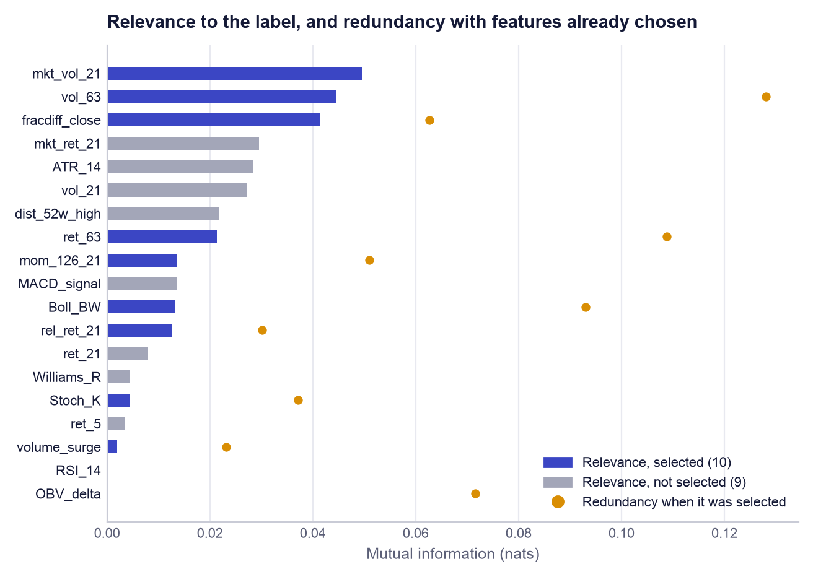

*Figure 3. Feature selection. Bars show each feature's mutual information with the 21-day forward return; dots show the redundancy of each selected feature with those chosen before it (the first pick, `mkt_vol_21`, has none). Several high-relevance features were rejected because they duplicate one already chosen.*

**Table 8. Feature-selection table, in the order features were chosen (mutual information in nats)**

| Order | Feature | Relevance | Redundancy | Score | Selected |
|---|---|---:|---:|---:|---|
| 1 | `mkt_vol_21` | 0.04958 | 0.00000 | +0.04958 | Yes |
| 2 | `fracdiff_close` | 0.04145 | 0.06266 | +0.01012 | Yes |
| 3 | `rel_ret_21` | 0.01256 | 0.03020 | -0.00254 | Yes |
| 4 | `volume_surge` | 0.00198 | 0.02310 | -0.00957 | Yes |
| 5 | `mom_126_21` | 0.01352 | 0.05096 | -0.01196 | Yes |
| 6 | `Stoch_K` | 0.00450 | 0.03709 | -0.01404 | Yes |
| 7 | `vol_63` | 0.04447 | 0.12802 | -0.01954 | Yes |
| 8 | `ret_63` | 0.02131 | 0.10876 | -0.03307 | Yes |
| 9 | `OBV_delta` | 0.00000 | 0.07155 | -0.03577 | Yes |
| 10 | `Boll_BW` | 0.01326 | 0.09296 | -0.03322 | Yes |
|  | `RSI_14` | 0.00000 |  |  | No |
|  | `MACD_signal` | 0.01351 |  |  | No |
|  | `ATR_14` | 0.02849 |  |  | No |
|  | `Williams_R` | 0.00450 |  |  | No |
|  | `ret_5` | 0.00335 |  |  | No |
|  | `ret_21` | 0.00794 |  |  | No |
|  | `vol_21` | 0.02719 |  |  | No |
|  | `dist_52w_high` | 0.02169 |  |  | No |
|  | `mkt_ret_21` | 0.02949 |  |  | No |

### 7.3 Reading the result

Three observations follow from Table 8 and Figure 3. First, every relevance value is small: the largest is 0.050 nats. No feature knows much about next month's return, which is the first honest signal that this is a hard prediction problem. Second, the penalty does what it was designed to do. `ATR_14`, `vol_21` and `mkt_ret_21` have higher relevance than several selected features but were left out because volatility and market information were already represented by `mkt_vol_21`, `vol_63` and `rel_ret_21`; of the Stoch_K and Williams_R twins only one was kept. Third, the method has a weakness that we report: `OBV_delta` has an estimated relevance of 0.00000 and was still chosen ninth, because once the informative features are taken, a feature that is merely *different* scores better than one that is informative but redundant. The SHAP analysis in Section 12 confirms that it contributes almost nothing to forecasts. A stricter rule (stop when the score turns negative) would have kept only two features.

### 7.4 Why company fundamentals were removed from the model

The original notebook also fed the model seven fundamental ratios: price-to-earnings, price-to-book, return on equity, debt-to-equity, net profit margin, dividend yield and revenue growth. Yahoo Finance supplies only **today's** value of each. The notebook copied today's value onto every historical row, so a training row dated 2019 "knew" the company's 2026 profitability. That is **look-ahead leakage**: information from the future reaching the model. It inflates every test score, because a company that is highly profitable in 2026 is, on average, one whose share price rose between 2019 and 2026.

The fundamentals were therefore removed from the list of candidate features, and a unit test (`test_fundamentals_are_not_model_inputs`) fails the build if any feature whose name begins with `f_` is added back. They are still used, legitimately, in one place: the application's separate **fundamental score** for *today's* decision (Section 14), where using today's ratios involves no look-ahead. The application and the artefact manifest both state that this score is not part of the validated forecast.

## 8. Modelling

### 8.1 Quantile regression and pinball loss

Ordinary regression minimises squared error, and the forecast that minimises squared error is the average outcome. An adviser needs more than the average: the client's question is "how bad could this be?". **Quantile regression** (Koenker and Bassett, 1978) forecasts a chosen percentile of the outcome instead. A P10 forecast is the level the return should fall below only 10% of the time; P50 is the median; P90 is the level it should exceed only 10% of the time. The interval from P10 to P90 should therefore contain 80% of outcomes.

A model is trained to forecast quantile *q* by minimising the **pinball loss**. For an actual return *y* and a forecast *ŷ*:

```
L(y, ŷ) = q × (y − ŷ)   if y ≥ ŷ          L(y, ŷ) = (1 − q) × (ŷ − y)   if y < ŷ
```

It is an absolute error with unequal prices on the two sides (Figure 4). For q = 0.1, an outcome *above* the forecast costs only 0.1 per unit, while an outcome *below* it costs 0.9 per unit. The cheapest place to put the forecast is therefore low, at the point where only 10% of outcomes fall beneath it. For q = 0.5 both sides cost the same and the loss is half the absolute error, whose minimiser is the median.

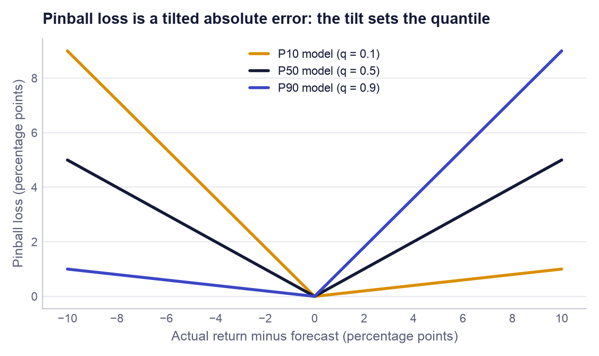

*Figure 4. Pinball loss for the three quantiles as a function of the forecast error. The asymmetric slopes are what push each model towards its own percentile.*

**A worked example.** Suppose the three forecasts for a stock are P10 = −6%, P50 = +1% and P90 = +9%, and the return turns out to be +2%. For P10 the outcome is 8 points above the forecast, so the loss is 0.1 × 0.08 = 0.008. For P50 it is 1 point above: 0.5 × 0.01 = 0.005. For P90 it is 7 points below: (1 − 0.9) × 0.07 = 0.007. The mean over the three quantiles is 0.0067. If the return had instead been −10%, four points *below* the P10 forecast, the P10 loss alone would be 0.9 × 0.04 = 0.036: a breach of the pessimistic case is punished heavily. The mean pinball loss over the three quantiles is the single number used to tune and compare models in this report; lower is better, and it is in the same units as the return.

### 8.2 Gradient-boosted trees and LightGBM in plain terms

A **decision tree** asks a sequence of yes/no questions about the features ("is market volatility above 1.4%?") and gives every row that reaches the same end-point, or leaf, the same prediction. One small tree is a crude model. **Gradient boosting** (Friedman, 2001) builds a strong model from many crude ones: start from a constant prediction, look at where the current model is wrong, fit a small tree to those errors, add a fraction of that tree's output to the model, and repeat. The fraction is the *learning rate*. With a quantile objective, "where the model is wrong" is defined by the pinball loss, and the starting constant is the corresponding percentile of the training labels.

**LightGBM** (Ke et al., 2017) is an efficient implementation of this idea. Two design choices matter here. It sorts each feature's values into a fixed number of bins before training, which makes finding split points fast. And it grows trees *leaf-wise*: it always splits the leaf whose split reduces the loss most, so tree size is controlled by the number of leaves (`num_leaves`) and not by depth. We chose gradient-boosted trees because they handle non-linear effects and interactions between features without manual specification, need no feature scaling, are robust to outliers in the inputs, support the quantile objective directly, and can be explained exactly with SHAP (Section 12).

### 8.3 Why three models, and the quantile-crossing fix

Each quantile has its own loss function, so each needs its own model: three separate LightGBM regressors with the objective set to `quantile` and `alpha` set to 0.1, 0.5 and 0.9. They share the same features and hyperparameters. Because they are trained independently, nothing forces their outputs to be ordered; occasionally the P10 model can predict a higher value than the P50 model for the same row, which is logically impossible. This is known as **quantile crossing**. The function `predict_quantiles` fixes it by sorting the three predictions for every row, so P10 ≤ P50 ≤ P90 always holds; a unit test feeds it deliberately crossed values and checks the ordering.

### 8.4 Baselines

A model's score means nothing without something to compare it with. Two baselines are run on exactly the same folds. The **naive baseline** ignores every feature: for each quantile it predicts the corresponding percentile of all returns in the training period, the same three numbers for every stock on every day. It answers the question "do the features add anything?". The **Ridge baseline** is a linear regression with an L2 penalty (Hoerl and Kennard, 1970) that predicts the expected return. It answers "does a non-linear model add anything over a straight-line one?". Its penalty strength *alpha* was chosen from six values between 0.1 and 10,000 by cross-validated mean absolute error; the largest, 10000, won, which itself says the data support only heavily shrunk coefficients. Ridge gives a single forecast and no quantiles, so it is compared on error and rank IC but has no pinball loss or coverage.

### 8.5 Scaling: needed for Ridge, not for trees

Ridge penalises the size of its coefficients, and the size of a coefficient depends on the units of its feature: RSI runs from 0 to 100 while a daily volatility is around 0.02. Without rescaling, the penalty would fall almost entirely on the small-unit features. Ridge is therefore run inside a scikit-learn pipeline with a `StandardScaler`, which subtracts each feature's mean and divides by its standard deviation. The scaler is **refitted on the training rows of every fold**; fitting it once on all the data would let validation-period statistics leak into training.

Trees need no scaling. A split asks only whether a feature is above or below a threshold, so any order-preserving transformation of the feature (rescaling, taking logs) produces exactly the same partitions of the rows. LightGBM therefore receives the raw features. This is a deliberate decision and not an omission.

## 9. Validation design

### 9.1 Why ordinary cross-validation is wrong for this data

Standard k-fold cross-validation shuffles the rows and holds out a random fifth at a time. With time-ordered market data that is wrong twice over. It trains on the future to predict the past, which no real user can do. And neighbouring rows are nearly duplicates: the 21-day return starting on Monday and the one starting on Tuesday share 20 of their 21 days, so a model can score well on a shuffled test simply by having seen an almost identical row in training.

### 9.2 Purged walk-forward cross-validation

The pipeline uses **walk-forward** validation with an expanding window. The development dates are cut into six equal blocks. Fold 1 trains on block 1 and validates on block 2; fold 2 trains on blocks 1 and 2 and validates on block 3; and so on, giving 5 folds (Figure 5, Table 9). Training data always precede validation data, exactly as in live use, and each fold tests the model on a different market period, including the sharp fall and recovery of early 2020 in fold 1.

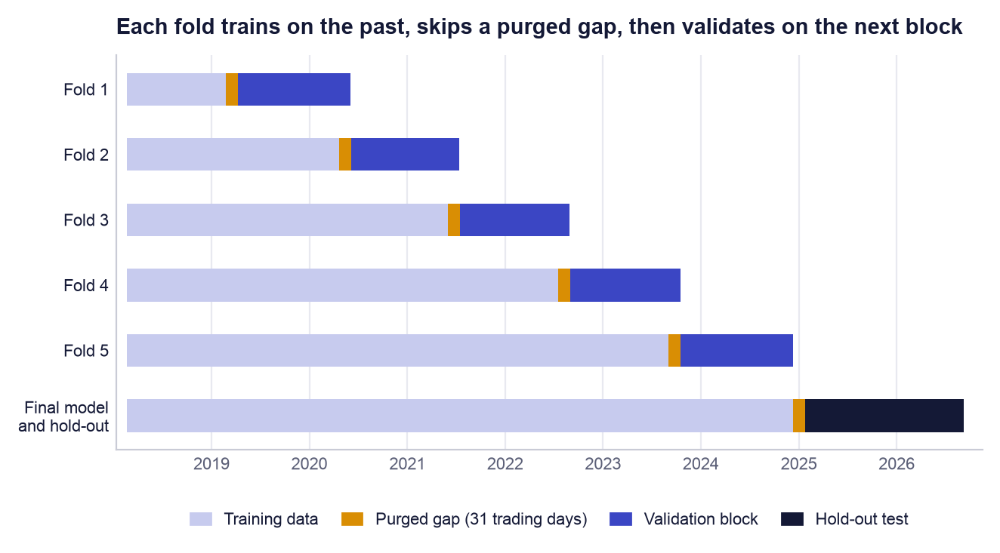

*Figure 5. Walk-forward folds and the final hold-out. The thin marigold strip before every validation block is the purged gap of 31 trading days.*

**Table 9. Cross-validation folds**

| Fold | Training rows | Validation rows | Validation from | Validation to |
|---|---:|---:|---|---|
| 1 | 6,205 | 16,491 | 2019-04-09 | 2020-06-03 |
| 2 | 22,645 | 16,520 | 2020-06-04 | 2021-07-14 |
| 3 | 39,165 | 16,520 | 2021-07-15 | 2022-08-30 |
| 4 | 55,685 | 16,794 | 2022-09-01 | 2023-10-17 |
| 5 | 72,448 | 16,800 | 2023-10-18 | 2024-12-09 |
| Final | 91,108 | 24,413 | 2025-01-23 | 2026-09-09 |

### 9.3 Why the gap is 31 trading days

A training row dated day *t* carries a label that depends on the price at *t* + 21. If the last training day were the day before validation starts, its label would be computed from prices inside the validation period: the model would be trained on information from the very days it is about to be tested on. **Purging** removes those rows: the last 21 trading days before each validation block are dropped from training, so the latest training label ends before validation begins. A further **embargo** of 10 trading days is added as a safety margin, because volatility and market mood persist for days and a label ending the day before validation still describes almost the same market. 21 + 10 = 31 trading days, about six calendar weeks. Both ideas are from López de Prado (2018). The gap costs data, which is why fold 1 trains on only 6,205 rows.

### 9.4 The hold-out period

Cross-validation is used many times: to compare 25 hyperparameter settings and six Ridge penalties. Any number that has been used to choose among options is optimistic, because the winner is partly the luckiest. The hold-out period, 2025-01-23 to 2026-09-09 (24,413 rows over 407 trading days), played no part in any choice. After tuning, the three final models were refitted once on all development data with the chosen settings and scored once on the hold-out. Those are the numbers a user should expect in live use, and they are the ones quoted in the executive summary.

### 9.5 Leakage controls

Table 10 lists every route by which future information could reach the model and the control that closes it.

**Table 10. Leakage controls**

| Risk | Control | Where enforced |
|---|---|---|
| Training labels overlap the validation period | 31-day purge and embargo before every validation block | `walk_forward_splits`; test `test_walk_forward_folds_never_train_on_the_future` |
| Development labels overlap the hold-out period | The same 31-day gap before the hold-out | `holdout_dates`; test `test_holdout_is_purged_from_development` |
| Training on the future | Expanding window: validation always follows training | `walk_forward_splits` |
| Today's fundamentals copied onto past dates | Fundamentals removed from model inputs | `CANDIDATE_FEATURES`; test `test_fundamentals_are_not_model_inputs` |
| Feature selection sees the hold-out | Mutual information computed on development rows only | `train()` in `src/model.py` |
| Differencing order tuned on the hold-out | *d* chosen from prices up to the development end date | `fit_until` in `stock_features` |
| Scaler fitted on validation data | `StandardScaler` inside the pipeline, refitted per fold | `cross_validate_baselines` |
| Hyperparameters tuned on the hold-out | Search scored only on development folds | `tune_lightgbm` |
| Features use future prices | Every indicator uses rolling windows that end at day *t* | `stock_features` |

One residual imperfection should be stated. Feature selection and the differencing order are fitted once on the whole development set, and the cross-validation folds are then drawn inside that set. The fold scores are therefore very slightly optimistic, because the selection step has seen the fold's validation rows. The hold-out is not affected, and it is the hold-out on which our conclusions rest.

## 10. Hyperparameter optimisation

### 10.1 Search space and method

Hyperparameters are the settings fixed before training. Seven were searched (Table 11). Their grid contains 6,912 combinations, too many to try exhaustively, so the pipeline uses **random search**: it draws 24 combinations at random (with a fixed seed of 42, so the draw is repeatable) and adds the original notebook settings as trial 0, for 25 settings in all. Random search covers a large space more efficiently than a grid when only a few of the parameters matter (Bergstra and Bengio, 2012). Each setting is trained on all 5 folds for all three quantiles: 25 × 5 × 3 = 375 model fits, run in parallel. The score for a setting is its mean pinball loss across the three quantiles, averaged over the five folds.

**Table 11. Hyperparameter search space**

| Parameter | Values tried | What it controls | Notebook | Chosen |
|---|---|---|---:|---:|
| `n_estimators` | 100, 200, 400, 800 | Number of trees added one after another. More trees fit the training data more closely. | 400 | **100** |
| `learning_rate` | 0.01, 0.02, 0.05 | Fraction of each new tree's correction that is kept. Small values make learning slower and smoother. | 0.03 | **0.02** |
| `num_leaves` | 4, 8, 16, 31 | Maximum end-points (leaves) per tree. Four leaves means at most three yes/no questions per tree. | 31 | **4** |
| `min_child_samples` | 50, 200, 500, 1000 | Minimum training rows a leaf must contain. Larger values stop the tree isolating small, noisy groups. | 50 | **50** |
| `subsample` | 0.6, 0.8, 1 | Share of training rows drawn at random for each tree. | 0.8 | **0.8** |
| `colsample_bytree` | 0.5, 0.7, 1 | Share of the features offered to each tree. | 0.8 | **0.5** |
| `reg_lambda` | 0, 1, 10, 50 | L2 penalty that shrinks leaf values towards zero. | 0 | **0** |

### 10.2 What the search found

**Table 12. Best five and worst five settings by cross-validated pinball loss (full list in Appendix B)**

| # | Trial | Pinball mean | Fold s.d. | Trees | Learn. rate | Leaves | Min. leaf rows | Row share | Feature share | L2 |
|---|---|---:|---:|---:|---:|---:|---:|---:|---:|---:|
| 1 | 19 (chosen) | 0.02406 | 0.00529 | 100 | 0.02 | 4 | 50 | 0.8 | 0.5 | 0 |
| 2 | 16 | 0.02407 | 0.00523 | 100 | 0.01 | 31 | 1000 | 0.6 | 0.7 | 1 |
| 3 | 4 | 0.02407 | 0.00523 | 100 | 0.01 | 4 | 1000 | 0.8 | 1 | 10 |
| 4 | 3 | 0.02416 | 0.00523 | 100 | 0.01 | 31 | 1000 | 0.6 | 1 | 10 |
| 5 | 12 | 0.02419 | 0.00543 | 100 | 0.02 | 4 | 200 | 0.8 | 1 | 50 |
| … |  |  |  |  |  |  |  |  |  |  |
| 21 | 18 | 0.02620 | 0.00725 | 800 | 0.05 | 4 | 50 | 1 | 0.5 | 1 |
| 22 | 13 | 0.02640 | 0.00702 | 200 | 0.05 | 31 | 50 | 0.6 | 1 | 1 |
| 23 | 0 (notebook) | 0.02648 | 0.00721 | 400 | 0.03 | 31 | 50 | 0.8 | 0.8 | 0 |
| 24 | 14 | 0.02667 | 0.00713 | 800 | 0.02 | 31 | 200 | 0.6 | 0.7 | 0 |
| 25 | 8 | 0.02669 | 0.00731 | 400 | 0.05 | 16 | 50 | 0.8 | 1 | 0 |

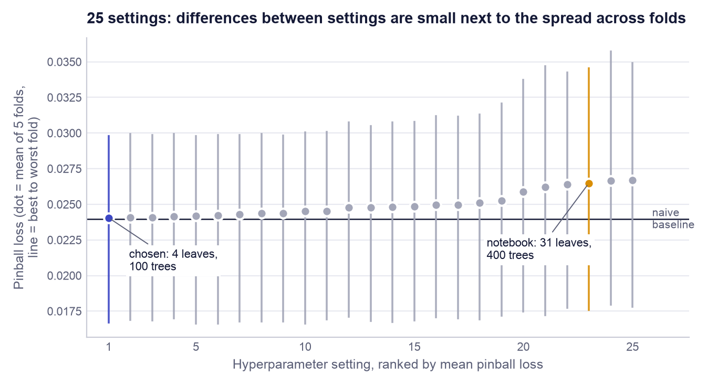

*Figure 6. All 25 settings ranked by mean pinball loss. Each dot is the mean over five folds and each vertical line runs from the best to the worst fold. The chosen setting is indigo, the original notebook setting marigold, and the horizontal line is the naive baseline.*

The chosen setting is trial 19: n_estimators=100, learning_rate=0.02, num_leaves=4, min_child_samples=50, subsample=0.8, colsample_bytree=0.5, reg_lambda=0. Its cross-validated pinball loss is 0.02406 (standard deviation across folds 0.00529), against 0.02648 for the notebook settings: an improvement of 9.2%. The notebook setting ranks 23 of 25.

### 10.3 Why small trees won

The pattern in Table 12 and Appendix B is consistent. All eight best settings use 100 or 200 trees, and each is constrained in at least one way: very few leaves (4 or 8), or a very large minimum leaf size (1,000 rows), or a low learning rate. The worst settings have many trees (400 or 800), a high learning rate, large trees, or several of these together; no setting with 400 or more trees ranks in the top twelve. In other words, the more freedom the model was given, the worse it did out of sample. This is the signature of a **low signal-to-noise** problem: a 31-leaf tree has enough flexibility to memorise accidental patterns in past returns, and those patterns do not repeat.

The chosen model is small in a precise sense. Each tree has 4 leaves, so it asks at most three questions and can combine at most three features. With 100 trees and a learning rate of 0.02, the model starts from the historical percentile and adds one hundred corrections, each scaled down to 2% of what the tree proposed. It is therefore a cautious adjustment of the naive forecast, not a replacement for it, which is exactly why its cross-validated score lands so close to the naive baseline (Section 11). `colsample_bytree` = 0.5 offers each tree a random half of the ten features, and `subsample` = 0.8 a random 80% of rows, which makes the trees differ from one another and averages out noise.

Two cautions apply. The top five settings are separated by 0.00013 in pinball loss, while the standard deviation across folds is about 0.005: the ranking among them is not statistically meaningful, and we chose the lowest mean because a rule fixed in advance is better than a choice made after looking. And Figure 6 shows that which *period* is being predicted moves the loss far more than which *setting* is used.

## 11. Results

### 11.1 Cross-validation: four candidates on the same folds

**Table 13. Cross-validation results (mean over five folds; ± is the standard deviation across folds)**

| Model | Pinball loss | MAE | Rank IC | Coverage | Direction right |
|---|---:|---:|---:|---:|---:|
| Naive (historical quantiles) | 0.02395 ± 0.00493 | 0.0722 | +0.000 ± 0.000 | 81.6% | 59.2% |
| Ridge (scaled features) | n/a | 0.0731 | +0.025 ± 0.055 | n/a | 53.9% |
| LightGBM quantile, notebook settings | 0.02648 ± 0.00721 | 0.0790 | -0.009 ± 0.038 | 65.8% | 51.6% |
| **LightGBM quantile, tuned** | 0.02406 ± 0.00529 | 0.0727 | +0.004 ± 0.067 | 78.9% | 54.4% |

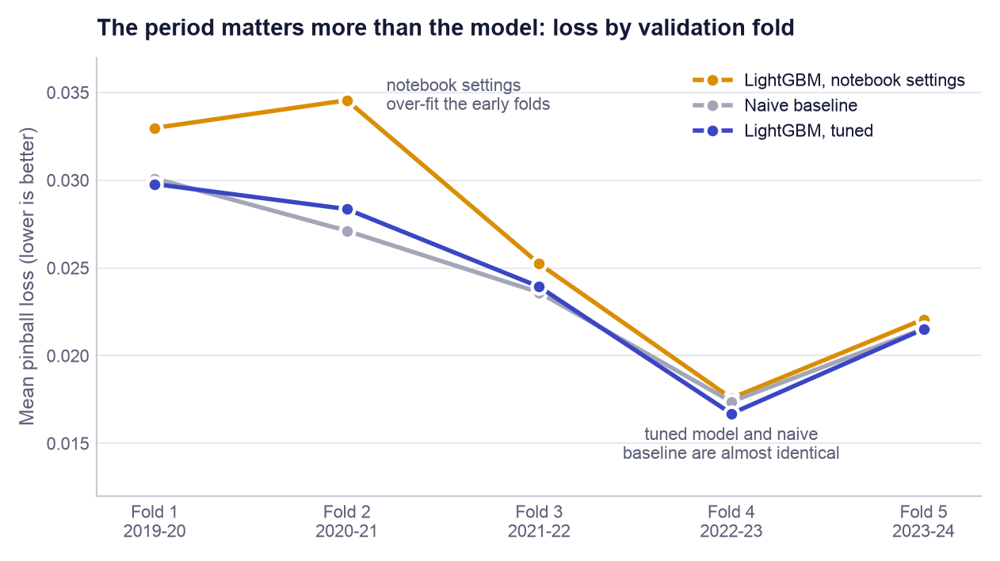

*Figure 7. Pinball loss in each validation fold for the three quantile candidates. Ridge is omitted because it produces no quantiles.*

Table 13 and Figure 7 give three findings. **Tuning mattered.** The notebook settings were not merely sub-optimal; they were worse than using no features at all (0.02648 against 0.02395), and their P10 to P90 band contained only 65.8% of outcomes instead of 80%: an over-fitted model is over-confident. **The tuned model ties the naive baseline.** Its loss of 0.02406 is 0.5% *worse* than the naive 0.02395, a gap of 0.00011 that is roughly one-fiftieth of the fold-to-fold standard deviation. The correct reading is "no detectable difference". **Ranking skill is not established in cross-validation.** The tuned model's mean rank IC is +0.004 with a standard deviation of 0.067: positive in two folds and negative in three. The naive baseline has the highest directional accuracy (59.2%) for a simple reason: its median forecast is always slightly positive, and in a rising market "up" is the right call more often than not.

### 11.2 Hold-out test

**Table 14. Hold-out results, 2025-01-23 to 2026-09-09 (24,413 rows)**

| Measure | LightGBM (tuned) | Naive | Ridge | Better is |
|---|---:|---:|---:|---|
| Pinball loss (mean of 3 quantiles) | **0.01880** | 0.01915 | n/a | lower |
| P10 to P90 coverage (target 80%) | **82.4%** | 85.0% | n/a | closer to 80% |
| Average band width | **19.9 pp** | 21.6 pp | n/a | narrower, if coverage holds |
| MAE of the median forecast | 0.0583 | 0.0584 | **0.0580** | lower |
| RMSE of the median forecast | **0.0771** | 0.0773 | 0.0772 | lower |
| Direction right | 51.0% | 51.0% | **51.3%** | higher |
| Mean daily rank IC | +0.046 | 0 (no ranking) | **+0.052** | higher |
| Days with positive rank IC | 55.8% of 407 | n/a | **57.2%** of 407 | higher |

On data the model never saw, the picture is slightly more favourable but tells the same story (Table 14). The tuned model's pinball loss is 1.8% lower than the naive baseline's. More usefully, it achieves this with a band that is 7.9% narrower (19.9 against 21.6 percentage points) while its coverage is closer to the 80% target. A narrower band that is still honest is a real, if modest, gain for the user. On point accuracy the three models are indistinguishable: mean absolute errors of 0.0583, 0.0584 and 0.0580 differ in the fourth decimal place, and the direction of the move is called correctly 51.0% of the time, barely better than a coin. The simple linear Ridge model is marginally ahead of LightGBM on mean absolute error and rank IC, which is further evidence that the data do not reward model complexity.

### 11.3 Coverage and calibration

A forecast band is **calibrated** when it contains the share of outcomes it promises. The P10 to P90 band promises 80%. On the hold-out it contained 82.4% (Figure 8): slightly conservative, erring on the side of a band that is a little too wide, which is the safer direction when the band is used to warn a client about downside. Across the cross-validation folds coverage ranged from 69.9% to 90.1%. Calibration therefore holds on average but not in every market period: a band learned from a calm history is too narrow when a turbulent period follows (fold 1), and too wide in the reverse case (fold 4). This is the product's strongest measured property, and the claim attached to it is deliberately limited: "about four outcomes in five have fallen inside the range", not "the range is guaranteed".

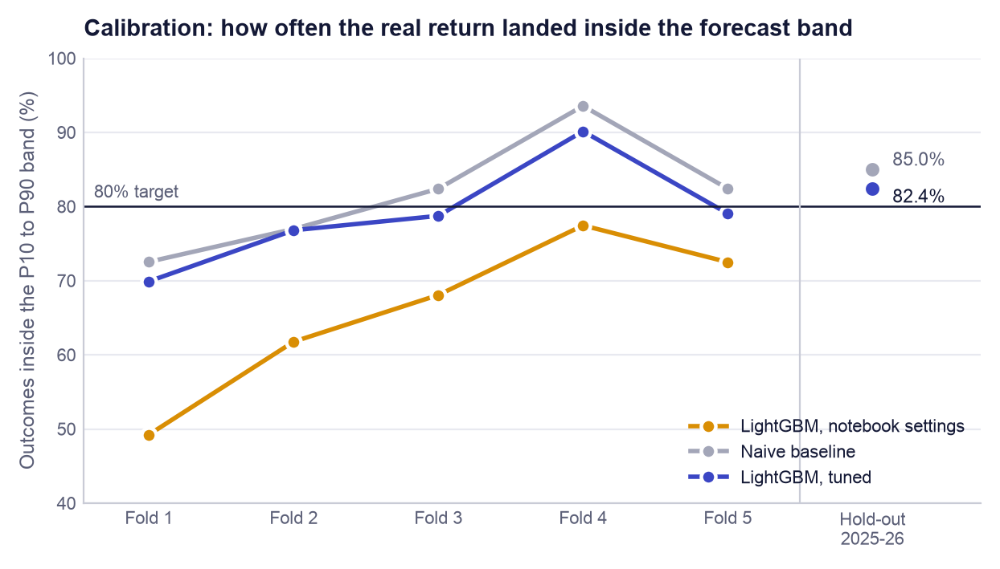

*Figure 8. Share of real outcomes inside the P10 to P90 band, by cross-validation fold and on the hold-out. The notebook settings were systematically over-confident; the tuned model tracks the 80% target on average.*

### 11.4 Rank information coefficient

The **rank information coefficient** (rank IC) asks a different question from error: on a given day, did the stocks the model ranked highest go on to do best? It is the Spearman rank correlation, across the 60 stocks, between the day's median forecasts and the returns that followed, computed for each day and then averaged. Zero means no ordering skill and +1 a perfect ordering. In equity forecasting, values of a few hundredths are typical of real signals, so small numbers are expected; what matters is whether they are reliably positive.

On the hold-out the mean rank IC is +0.046, positive on 55.8% of 407 days. That is encouraging, but two facts temper it. The same statistic was +0.004 ± 0.067 across the cross-validation folds, so a single positive period cannot be told apart from chance. And daily values on overlapping 21-day returns are strongly correlated with each other, so 407 days are far fewer than 407 independent observations. We therefore describe ranking skill as *unproven*, not as weak-but-present.

### 11.5 Do the ratings mean anything? Realised returns by signal

The model also emits a five-level signal from the day's ranking. Table 15 shows what followed each signal on the hold-out. The three middle levels are ordered as intended: BUY rows returned +0.77% on average, HOLD +0.53% and SELL -0.24%. The two extreme levels are not: the 416 STRONG_BUY rows *lost* 1.69% on average and STRONG_SELL rows gained. The "strong" labels require both an extreme forecast and a narrow band, a combination that proved unreliable. This is why the application does not pass the raw model signal to the user: the decision engine in Section 14 requires agreement from other evidence before issuing a STRONG BUY.

**Table 15. Hold-out outcomes by raw model signal**

| Model signal | Rows | Mean 21-day return | Share with a positive return |
|---|---:|---:|---:|
| STRONG_BUY | 416 | -1.69% | 40.6% |
| BUY | 9,140 | +0.77% | 52.2% |
| HOLD | 6,706 | +0.53% | 52.1% |
| SELL | 5,082 | -0.24% | 48.1% |
| STRONG_SELL | 3,069 | +0.27% | 51.0% |

### 11.6 Backtest

A backtest converts forecasts into money. The rule is simple and fixed in advance: every 21 trading days hold the 5 highest median forecasts, equal weight; benchmark = all stocks equal weight; 20 bps cost on traded value. Because a 21-day rebalancing schedule can start on any of 21 different days, and the result should not depend on that accident, the backtest is repeated for all 21 start days and the median and range are reported (Table 16). Figure 9 plots the first of those runs.

**Table 16. Backtest over 21 start days, after 20 bps costs (top-5 strategy against all stocks equally weighted)**

| Measure | Hold-out (2025 to 2026) | Cross-validation years (2019 to 2024) |
|---|---:|---:|
| Strategy annual return, median | -4.4% | +30.5% |
| Benchmark annual return, median | +3.3% | +28.8% |
| Annual excess return, median | **-6.4%** | +1.6% |
| Annual excess return, range | -16.8% to +7.1% | -4.3% to +16.6% |
| Start days on which the strategy won | 24% | 67% |
| Maximum drawdown, median: strategy / benchmark | 26.0% / 8.4% | 26.3% / 27.1% |
| First run: t-statistic of the per-period excess | -0.17 (20 periods) | +0.51 (67 periods) |
| First run: probability the true excess is positive | 44% | 70% |

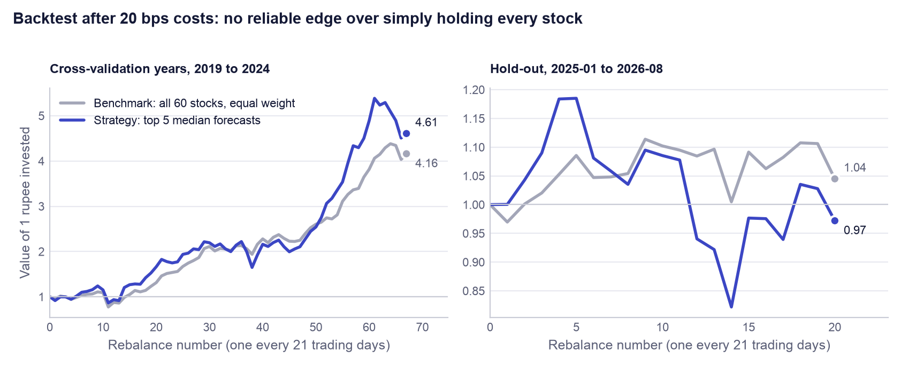

*Figure 9. Growth of one rupee in the first of the 21 backtest runs. Left: the cross-validation years, using out-of-fold forecasts. Right: the hold-out period. Each panel has its own scale.*

**The top-5 strategy did not beat the benchmark on the hold-out.** Its median annual return was -4.4% against +3.3% for holding all 60 stocks equally, a median shortfall of 6.4% a year; it won from only 24% of start days, and its worst peak-to-trough fall was about three times the benchmark's (26.0% against 8.4%), which is what concentrating in five names does. In the cross-validation years the strategy was ahead by a median 1.6% a year, but the t-statistic of 0.51 is far below the conventional threshold of 2, and the probability that the true excess is positive (the probabilistic Sharpe ratio of Bailey and López de Prado, 2012) is 70%: not evidence of skill. The backtest also ignores taxes, market impact and any slippage beyond the flat 20 bps, all of which would make the strategy's result worse.

### 11.7 What the product can and cannot claim

> **An honest reading of the results.** **Can claim:** (1) calibrated risk ranges: 82.4% hold-out coverage against an 80% target, with a band 7.9% narrower than a no-feature baseline; (2) a properly validated pipeline in which tuning demonstrably repaired an over-fitted model (9.2% lower loss); (3) consistent, explainable, profile-aware screening that saves time. **Cannot claim:** (1) that the model predicts returns better than historical percentiles (a tie in cross-validation, 1.8% better on the hold-out); (2) reliable stock-picking skill (rank IC unstable across periods); (3) that following its top picks beats holding the universe (it did not on the hold-out).

Why ship a model that only ties a naive baseline? Because the product is not sold on the forecast's edge. The naive baseline cannot tell a user that a real-estate stock has a wider range than a bank, cannot adapt its band when market volatility rises, and cannot explain itself. The quantile model does those things at no cost in accuracy. And a result of "no detectable edge", obtained with a leak-free method, is itself useful to an adviser: it is a documented reason not to promise clients market-beating picks.

## 12. Explainability

### 12.1 What SHAP values are

A forecast that cannot be explained cannot be defended to a client. **SHAP** (SHapley Additive exPlanations; Lundberg and Lee, 2017) explains one prediction at a time by sharing it out among the features. The idea comes from Shapley values in co-operative game theory: treat the features as players in a team, the prediction as the team's payout, and give each player the average of what it adds across all the orders in which the team could be assembled. The result has an exact accounting property: the model's average prediction (the *base value*) plus the SHAP values of all features equals the prediction for that row. A SHAP value of +0.004 for a feature means that this feature's value, for this stock today, moved the forecast 0.4 percentage points above where it would otherwise be. For tree models the `TreeExplainer` algorithm (Lundberg et al., 2020) computes these values exactly and quickly, which is one reason a tree model was chosen. LIME, the alternative named in the brief, fits a local approximation and gives slightly different answers on each run; SHAP's exactness and additivity made it the better fit.

### 12.2 Global importance

Averaging the absolute SHAP values over a random sample of 5,000 hold-out rows gives each feature's overall influence on the median (P50) model (Figure 10). The largest driver is `mkt_vol_21`, the market-wide volatility, with a mean absolute contribution of 0.45 percentage points; it is followed by `mom_126_21`, `fracdiff_close`, `vol_63` and `ret_63`. The remaining five features together contribute 0.033 percentage points: in practice the model uses five inputs.

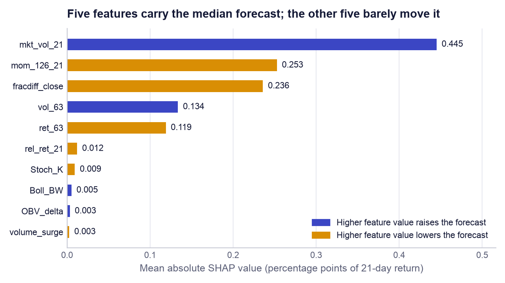

*Figure 10. Global SHAP importance of the median model on hold-out rows. Colour shows the direction of the relationship (the sign of the rank correlation between the feature's value and its SHAP value).*

The directions make economic sense and also explain the results of Section 11. Higher market volatility raises the forecast (direction +0.30), consistent with markets recovering after turbulent spells. Higher six-month momentum, a higher fractionally differenced price and a higher three-month return all *lower* the forecast (directions -0.68, -0.54 and -0.62): the model has learned mean reversion, expecting stocks that have run up to give some back. The important point is the first one. The strongest feature is the same for every stock on a given day, so it moves all forecasts up or down together. It helps to set the *level and width* of the forecast band, which is where the model is good, but it cannot help to *rank* one stock above another, which is where the model is weak.

### 12.3 How one stock's explanation reads in the application

On the Stock research tab the application runs `TreeExplainer` on the median model for the selected stock's latest row and lists up to eight features, largest first, each with its impact and whether it pushed the forecast up or down. An adviser reads it as a sentence. If, for example, the top rows were `mkt_vol_21` positive, `mom_126_21` negative and `fracdiff_close` negative, the explanation to the client would be: "the model's central estimate is a little above average because markets have been volatile, which has historically been followed by recovery, but it is held back because this share has already risen strongly over six months." (That example is illustrative wording, not a quoted output.) The same tab shows the technical indicators and the fundamental snapshot beside the SHAP list, so the adviser can check the model's reasons against the chart.

## 13. Error analysis

An average hides where a model fails. The hold-out rows were therefore split three ways: by market volatility (thirds of `mkt_vol_21` within the hold-out, labelled calm, normal and turbulent), by what the market then did (whether the average stock rose or fell over the following 21 days), and by sector. The second split uses the outcome, so it is a diagnosis and not something a user could act on in advance.

**Table 17. Hold-out forecast quality by volatility regime and market direction**

| Group | Rows | MAE | Coverage | Band width | Direction right | Rank IC |
|---|---:|---:|---:|---:|---:|---:|
| Calm | 8,159 | 0.0517 | 82.4% | 17.9 pp | 45.7% | -0.079 |
| Normal | 8,158 | 0.0552 | 85.0% | 19.9 pp | 55.0% | +0.076 |
| Turbulent | 8,096 | 0.0680 | 79.8% | 22.0 pp | 52.3% | +0.142 |
| Market fell | 9,895 | 0.0661 | 75.3% | 19.7 pp | 31.1% | -0.035 |
| Market rose | 14,518 | 0.0529 | 87.3% | 20.0 pp | 64.6% | +0.101 |

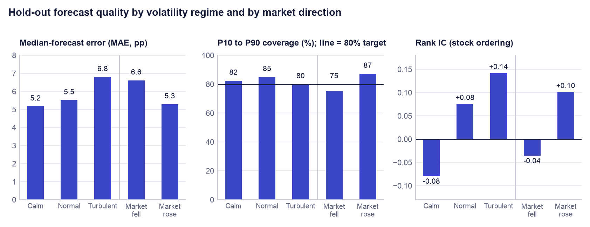

*Figure 11. Hold-out error, coverage and rank IC by volatility regime (left three bars) and by the market's subsequent direction (right two bars). Each panel has its own scale.*

### 13.1 By volatility regime

Error rises with turbulence, as it should: the mean absolute error is 0.0517 in calm markets and 0.0680 in turbulent ones (Table 17, Figure 11). The model responds correctly by widening its band from 17.9 to 22.0 percentage points, and coverage stays within about five points of target in every regime (82.4%, 85.0%, 79.8%). This is the behaviour a risk tool needs. Ranking is a different matter: rank IC is +0.142 in turbulent markets but *negative* (-0.079) in calm ones, where it was positive on only 28% of days. The mean-reversion pattern the model learned pays when prices are moving violently and works against it when quiet trends persist.

### 13.2 By market direction

When the market went on to fall, the median forecast had the direction right only 31.1% of the time and coverage dropped to 75.3%; when it rose, the figures were 64.6% and 87.3%. The model does not forecast market-wide falls. Its median is usually slightly positive, reflecting the long-run upward drift in its training data, so it is "right" in rising months and "wrong" in falling ones. A user must not read a positive median as protection against a market decline; the P10 figure is the number that speaks to that risk, and even it is breached more often than intended when the whole market falls.

### 13.3 By sector

**Table 18. Hold-out forecast quality by sector, ordered by coverage**

| Sector | MAE | Coverage | Band width | Direction right | Rank IC |
|---|---:|---:|---:|---:|---:|
| IT Services | 0.0692 | 72.9% | 20.1 pp | 43.4% | +0.113 |
| Real Estate & Construction | 0.0744 | 72.9% | 21.4 pp | 47.3% | +0.157 |
| Consumer Discretionary & Retail | 0.0712 | 77.0% | 21.4 pp | 50.2% | -0.006 |
| Automobiles | 0.0580 | 79.6% | 19.2 pp | 56.2% | -0.021 |
| Chemicals | 0.0586 | 81.8% | 19.7 pp | 44.4% | -0.007 |
| Capital Goods & Defence | 0.0625 | 82.4% | 20.9 pp | 53.7% | -0.016 |
| Metals & Mining | 0.0605 | 85.8% | 20.7 pp | 60.8% | +0.017 |
| FMCG | 0.0485 | 86.2% | 17.9 pp | 43.7% | +0.068 |
| Oil, Gas & Energy | 0.0512 | 87.0% | 20.1 pp | 53.6% | +0.109 |
| Banks & NBFC | 0.0460 | 87.2% | 18.3 pp | 59.8% | +0.118 |
| Utilities & Power | 0.0528 | 88.0% | 20.5 pp | 44.8% | +0.185 |
| Pharma & Healthcare | 0.0464 | 88.1% | 18.7 pp | 54.1% | -0.035 |

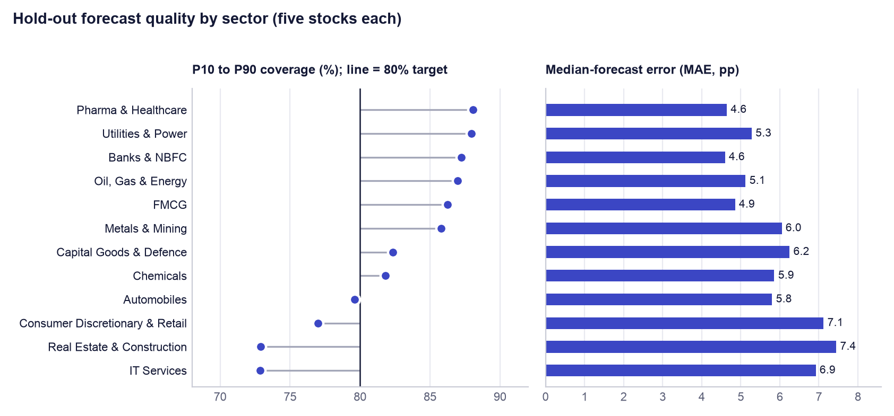

*Figure 12. Hold-out coverage and error by sector. Sectors are ordered by coverage, lowest at the bottom.*

Coverage is clearly below target in three sectors: IT Services (72.9%), Real Estate & Construction (72.9%) and Consumer Discretionary & Retail (77.0%); these are also the sectors with the largest errors (Table 18, Figure 12). It is above target in defensive sectors such as Pharma & Healthcare (88.1%) and Utilities & Power (88.0%). The reason is structural: the model has no sector input and its strongest feature is market-wide, so it gives broadly similar band widths to all stocks (between 17.9 and 21.4 percentage points) although their true ranges differ by more. Bands are a little too narrow for volatile sectors and a little too wide for stable ones. The sector rank IC values should be read with caution, since each is a correlation across only five stocks a day. Adding sector, or calibrating bands sector by sector, is the first modelling improvement we would make.

## 14. The decision engine

The forecast is one input to the recommendation, not the recommendation itself. Given how modest the forecast's edge is, this separation is a design decision and not a detail. The decision engine (`src/portfolio_advisor/core.py`) is deterministic, rule-based code: the same inputs always give the same output, and every rule can be read.

### 14.1 Four pillars

For every stock on the chosen date the engine computes four scores, each a z-score across the universe (how many standard deviations the stock is from the day's average), clipped to ±3.

- **Technical.** The weighted average of eleven indicator z-scores. RSI, MACD, 5-day and 21-day return, fractionally differenced price, on-balance-volume change and stochastic %K count in favour; Williams %R, 21-day volatility, ATR and Bollinger width count against. The 21-day return, MACD and differenced price carry a weight of 1.25, the rest 1. (Because Williams %R is stochastic %K shifted by 100, those two terms offset each other in the current code, so the score effectively rests on the other nine.)
- **Fundamental.** The weighted average of seven ratio z-scores from today's snapshot. Low price-to-earnings, low price-to-book and low debt-to-equity score well, as do high return on equity, net margin, dividend yield and revenue growth. Return on equity, net margin and revenue growth carry a weight of 1.15, the rest 1. Valuation ratios are log-transformed first so that one extreme value does not dominate.
- **Model.** The z-score of the stock's median 21-day forecast among that day's forecasts.
- **Portfolio fit (risk).** −0.55 × the z-score of trailing annual volatility − 0.45 × the z-score of trailing maximum drawdown, so that calmer stocks score higher.

### 14.2 Combining the pillars by risk profile

The overall score is a weighted sum of the four pillars, and the weights are what make the product profile-aware (Table 19). A Conservative profile leans on fundamentals and risk and gives the model forecast the least say (15%); an Aggressive profile leans on technical momentum and the model. The weighted sum is then mapped to a 0 to 100 scale by 50 + 50 × tanh(x ÷ 1.5), which keeps an average stock at 50 and compresses extremes. The same table shows the limits each profile applies before a stock may enter the portfolio.

**Table 19. Risk-profile presets from `core.py`: pillar weights and eligibility limits**

| Setting | Conservative | Moderate | Aggressive |
|---|---:|---:|---:|
| Weight: technical | 25% | 30% | 40% |
| Weight: fundamental | 40% | 30% | 20% |
| Weight: model forecast | 15% | 25% | 30% |
| Weight: portfolio fit (risk) | 20% | 15% | 10% |
| Minimum confidence | 0.60 | 0.40 | 0.20 |
| Maximum annual volatility | 35% | 60% | 125% |
| Maximum trailing drawdown | 30% | 45% | 70% |
| Maximum weight of one position | 20% | 30% | 40% |
| Minimum fundamental score (0 to 100) | 55 | 45 | 35 |

### 14.3 Recommendation states

Two further quantities enter the rating. *Confidence* is one minus the percentile rank of the stock's P10 to P90 band width among that day's bands: the narrowest band has confidence near 1. *Evidence confidence* blends it with agreement between pillars: 0.60 × confidence + 0.25 × agreement (1 if the technical and fundamental scores have the same sign, otherwise 0.5) + 0.15 if fundamental data exist for the stock. A stock is *model-positive* if its model signal is a buy or its median forecast is not negative. The four states follow in order (Table 20).

**Table 20. Recommendation states**

| Rating | Rule |
|---|---|
| STRONG BUY | Model-positive, overall score at least 70, and evidence confidence at least the profile's minimum confidence |
| BUY | Model-positive, overall score at least 50, and evidence confidence at least 85% of the profile's minimum |
| PASS | Not model-positive, or overall score below 42 |
| WATCH | Everything else: evidence is mixed and needs confirmation |

Only STRONG BUY and BUY stocks can enter the portfolio, and only if they also pass every profile limit: confidence, minimum expected return, volatility, drawdown, fundamental score, and any sector or ticker exclusion. Eligible stocks are ranked by overall score and the top *N* are taken, where *N* is the user's maximum number of holdings. If nothing qualifies, the engine shows the best WATCH names, clearly marked as a watchlist, instead of forcing a portfolio. Each row also carries plain-language risk flags (volatility above 60%, drawdown above 40%, price-to-earnings above 40, debt-to-equity above 150, or confidence below 0.35) and a one-sentence reason.

### 14.4 Position sizing: Hierarchical Risk Parity, step by step

Having chosen the stocks, the engine must decide how much of each to hold. Equal weights ignore risk. Classical mean-variance optimisation needs expected returns, which Section 11 shows we cannot estimate reliably, and it requires inverting the covariance matrix, which makes its weights unstable. **Hierarchical Risk Parity** (HRP; López de Prado, 2016) uses only risks and correlations and needs no matrix inversion. The engine applies it to the last 252 daily returns of the selected stocks.

1. **Measure similarity.** Compute the correlation between every pair of stocks and convert it to a distance, √(0.5 × (1 − correlation)), so that stocks moving together are close and stocks moving independently are far apart.
2. **Cluster.** Build a tree by repeatedly joining the two closest stocks or groups (single-linkage hierarchical clustering). Stocks from the same sector typically join early.
3. **Reorder.** List the stocks in the order of the tree's leaves, so that similar stocks sit next to each other (quasi-diagonalisation).
4. **Split the capital top-down.** Cut the ordered list in half. Estimate each half's variance using inverse-variance weights inside it, and give each half a share of capital inversely proportional to its variance: the riskier half gets less. Repeat inside each half until every stock stands alone (recursive bisection).

The effect is that two highly correlated bank stocks share one allocation between them instead of each taking a full slice, and a volatile stock receives less capital than a calm one. If fewer than 30 days of common history exist, or the clustering fails, the engine falls back to equal weights instead of guessing.

### 14.5 Tilt, position cap, whole shares and cash

Four practical steps follow. (1) **Tilt:** each HRP weight is multiplied by the stock's overall score ÷ 100 (limited to between 0.25 and 1.25) and the weights are rescaled to sum to one, so better-supported names get somewhat more. (2) **Cap:** no position may exceed the profile's maximum weight (20%, 30% or 40%); any excess is redistributed among the uncapped positions, repeatedly, until all comply. If the cap multiplied by the number of positions is below 100%, the remainder stays in cash. (3) **Whole shares:** the number of shares is the rupee allocation divided by the latest price, rounded *down*, because Indian cash equities trade in whole shares and the user must never be asked to spend more than the stated capital. (4) **Cash remainder:** whatever rounding and the cap leave over is reported as cash, and the summary shows the weights actually achieved. A unit test checks that the amount invested never exceeds the capital. The Portfolio lab tab also shows an illustrative schedule that splits each order into ten decreasing slices; it is a display only and no order is sent anywhere.

## 15. Engineering and reproducibility

### 15.1 Reproducibility in three commands

```bash
pip install -r requirements.txt
python -m src.model          # select, tune, cross-validate, train, test, export
streamlit run app.py         # open the product at http://localhost:8501
```

The second command retrains everything from the committed data snapshot in about a minute on a laptop and rewrites `reports/metrics.json`, `reports/cv_results.csv` and the model bundle. All randomness (the feature-selection sample, the random search, row and feature sampling inside LightGBM, the SHAP sample) uses the fixed seed 42. A fourth command, `python scripts/build_report.py`, regenerates this report and every figure in it from the two files in `reports/`, so no number in the text is typed by hand. `python -m src.data --refresh` downloads fresh prices when an update is wanted.

### 15.2 Automated tests

The repository has 22 automated tests, run with `pytest` and on every push by a GitHub Actions workflow that also byte-compiles the sources (Table 21). The six pipeline tests are the ones that matter most for a grader: they turn the leakage controls of Section 9 from statements into checks that fail the build if someone breaks them.

**Table 21. The 22 automated tests**

| File | Tests | What is checked |
|---|---:|---|
| `tests/test_pipeline.py` | 6 | Walk-forward folds never train on the future and keep the purge gap; the hold-out is separated from development by the gap; no fundamental feature is a model input; fractional differencing with d = 1 equals the ordinary difference; pinball-loss values and the P10 ≤ P50 ≤ P90 ordering after crossing; the saved report is internally consistent |
| `tests/test_core.py` | 5 | All four pillar scores are present; ticker and sector exclusions are obeyed; invested amount never exceeds capital; the order schedule sums to the target whole shares; validation and data-quality reports are available; outputs convert cleanly to JSON |
| `tests/test_chat.py` | 5 | The chat context covers the whole universe; the grounding prompt contains the data table; success, retry-on-transient-failure and not-configured paths |
| `tests/test_live.py` | 3 | Intraday return uses the previous close; the default provider is explicitly labelled not real-time; an Upstox feed message decodes correctly without a network |
| `tests/test_api.py` | 2 | The recommendations endpoint returns the profile analysis; the health endpoint reports a degraded state when the model bundle is missing |
| `tests/test_app.py` | 1 | The Streamlit application renders every tab against the real model bundle without an exception |

### 15.3 Deployment

The product is packaged as a Docker image built from `python:3.12-slim`. The image installs the pinned requirements, copies the source, the application and the `reports/` folder, exposes port 8501 and declares a health check against Streamlit's `/_stcore/health` endpoint. The model bundle is mounted read-only at `/app/data`, so the public container can read forecasts but cannot alter them. A `docker-compose.yml` file adds the optional FastAPI service as a second container. The live instance at https://fn.iimbg.com runs on Coolify, an open-source self-hosted deployment platform, on a virtual private server; a separate landing page at https://fin.iimbg.com introduces the product. Secrets (broker tokens, the chat API key) are supplied as environment variables in the platform and are excluded from the repository by `.gitignore`.

### 15.4 Vibe-coding workflow

The course asks teams to build with AI coding agents and to document how. The full record is `docs/VIBE_CODING_LOG.md`; this is a summary. The platform was Claude Code, Anthropic's terminal coding agent, with one orchestrating session and a background sub-agent, supported by Playwright for browser screenshots and by `uv`, `pytest` and the GitHub command line.

The work followed four steps. **Audit before building:** the agent was given the assignment and asked which existing project met it; it scored the project against the rubric row by row and found that the application and SHAP existed but tuning, cross-validation, the required file layout and the log did not. **Gap-driven build:** each missing rubric row became a concrete change, namely the random search, purged walk-forward validation, a scaled Ridge baseline, removal of the leaking fundamentals, and the move from a notebook to `src/data.py` and `src/model.py`. **Parallel delegation:** the landing page went to a sub-agent with a written brief stating its folder, the facts it could use, and a rule that no performance number could appear until real metrics existed. **Verify, then report:** every change was run end to end, including the training script, the tests and a render of the application.

Four prompting practices worked: giving the agent the grading rubric instead of a task list, so it could rank work by marks; asking for evidence (a met-or-missing table with file references) instead of a yes or no; briefing sub-agents like a colleague, with scope, facts and forbidden claims; and demanding honest numbers, which is how the tie with the naive baseline and the losing backtest came to be reported unchanged. Three things went wrong and are recorded: an ambiguous "this" sent the agent to the wrong repository for about an hour; joining forecasts onto a date index that repeats once per stock silently multiplied rows until a length check exposed it (forecasts are now attached by position, with a comment explaining why); and the notebook's settings turned out to be over-complex, which only cross-validation revealed.

The course's golden rule is that AI may write the scaffolding but the team must be able to explain every algorithm and parameter. Appendix A is the team's preparation for that test.

## 16. Limitations, risks, ethics and next steps

### 16.1 Limitations

- **The forecast has little or no edge.** Returns over 21 days are mostly noise. The model matches, and does not beat, historical percentiles in cross-validation; its ranking skill is unproven; its top picks lost to the benchmark on the hold-out.
- **Survivorship bias and a narrow universe.** 60 of today's large caps in one country. Results may not carry over to mid caps, small caps or other markets.
- **One hold-out period.** About 20 months of a single market regime. A different period could give different numbers in either direction.
- **Fundamentals are a snapshot.** The fundamental pillar uses today's ratios. It is valid for today's decision but has never been validated historically, because point-in-time fundamentals were not available.
- **The decision engine's weights are judgement.** The pillar weights, thresholds (70, 50, 42) and HRP tilt were set by design reasoning, not fitted or backtested. Only the forecast model has been validated.
- **Calibration varies by sector and period.** Bands are too narrow for IT, real estate and consumer discretionary stocks and when the whole market falls.
- **Simplified costs.** The backtest charges a flat 20 bps and ignores taxes, market impact and liquidity.
- **Cross-validation scores are slightly optimistic** because feature selection saw the whole development set (Section 9.5).

### 16.2 Risks in use

The main risk is **misplaced trust**: a user reading "STRONG BUY" as a promise. The mitigations are in the product: ranges instead of points, a Validation tab and Model report tab that show the weak results openly, a warning under the backtest, and research-only wording on every screen. A second risk is **staleness**: the model is retrained on demand, not continuously, so an old bundle could be served; the application prints the artefact date on every page. A third is **data quality**: Yahoo Finance is a free source without a service guarantee, and an erroneous price would flow into the features. A fourth is the **chat assistant**, which is a language model and can misstate figures even when given the right table; it is labelled research-only and is switched off unless configured.

### 16.3 Ethics and compliance

AI Portfolio Advisor is a **research and education tool**. It is not investment advice, it does not know a user's full financial situation, and its authors are not registered investment advisers or research analysts. In India, giving investment advice for a fee and publishing research recommendations are regulated by the Securities and Exchange Board of India (SEBI) under its Investment Advisers and Research Analysts regulations. A commercial launch would therefore need legal review, and the natural customer is an adviser who is already registered and who remains responsible for the advice given. The product supports that responsibility by making every recommendation traceable to its evidence. It stores no personal data: the profile is held only for the duration of the session. And it places no trades.

We also regard honest reporting as an ethical matter. A financial product that advertised the cross-validation backtest (+1.6% a year) and omitted the hold-out result (-6.4%) would mislead. Both are shown here and in the application.

### 16.4 Next steps

- **Point-in-time fundamentals,** so that the fundamental pillar can be validated and, if it earns its place, added to the model without leakage.
- **A market-relative label** (stock return minus the market's return), which targets ranking directly and removes the market-wide component the model cannot predict.
- **Sector-aware calibration** of the bands, for example conformal adjustment of P10 and P90 by sector.
- **A wider, survivorship-free universe** that includes companies later delisted or demoted.
- **Nested cross-validation,** with feature selection repeated inside each fold.
- **A paper-trading period** of at least six months, and a time-and-motion pilot with advisers to replace the ROI assumptions with measurements.

## References

Bailey, D. H. and López de Prado, M. (2012). The Sharpe ratio efficient frontier. *Journal of Risk*, 15(2).

Bergstra, J. and Bengio, Y. (2012). Random search for hyper-parameter optimization. *Journal of Machine Learning Research*, 13, 281–305.

Dickey, D. A. and Fuller, W. A. (1979). Distribution of the estimators for autoregressive time series with a unit root. *Journal of the American Statistical Association*, 74(366), 427–431.

Friedman, J. H. (2001). Greedy function approximation: a gradient boosting machine. *Annals of Statistics*, 29(5), 1189–1232.

Hoerl, A. E. and Kennard, R. W. (1970). Ridge regression: biased estimation for nonorthogonal problems. *Technometrics*, 12(1), 55–67.

Ke, G., Meng, Q., Finley, T., Wang, T., Chen, W., Ma, W., Ye, Q. and Liu, T.-Y. (2017). LightGBM: a highly efficient gradient boosting decision tree. *Advances in Neural Information Processing Systems*, 30.

Koenker, R. and Bassett, G. (1978). Regression quantiles. *Econometrica*, 46(1), 33–50.

López de Prado, M. (2016). Building diversified portfolios that outperform out of sample. *Journal of Portfolio Management*, 42(4), 59–69.

López de Prado, M. (2018). *Advances in Financial Machine Learning*. Wiley.

Lundberg, S. M. and Lee, S.-I. (2017). A unified approach to interpreting model predictions. *Advances in Neural Information Processing Systems*, 30.

Lundberg, S. M., Erion, G., Chen, H., et al. (2020). From local explanations to global understanding with explainable AI for trees. *Nature Machine Intelligence*, 2, 56–67.

Peng, H., Long, F. and Ding, C. (2005). Feature selection based on mutual information: criteria of max-dependency, max-relevance, and min-redundancy. *IEEE Transactions on Pattern Analysis and Machine Intelligence*, 27(8), 1226–1238.

## Appendix A. Technical-defence questions and answers

These are questions an examiner could put to any member of the team. Each answer is grounded in this project's code and results, and every team member should be able to give it without notes.

### A.1 Problem and data

**Q. What exactly is the model predicting?**

The percentage change in a stock's adjusted closing price over the next 21 trading days. It predicts three percentiles of that return, the 10th, 50th and 90th, and not a single number, so the output is a range. It is a regression problem, not a classification problem.

**Q. Why 21 trading days?**

It is about one calendar month, which matches how often our target user reviews a portfolio. A shorter horizon would be noisier and would imply more trading than an adviser's client does; a longer one would leave too few non-overlapping periods in eight years of data to validate anything.

**Q. What is survivorship bias and how does it affect you?**

We picked 60 companies that are large today, so companies that failed or shrank since 2018 are missing. That inflates the historical return of the universe. We limit the damage by comparing the strategy with the same 60 stocks held equally, so both sides carry the same bias, and we state it as a limitation.

**Q. Why did you remove fundamentals from the model when they obviously matter?**

Because we only have today's values. Copying a 2026 price-to-earnings ratio onto a 2019 row tells the model something about the future, which is look-ahead leakage and inflates test scores. Fundamentals still feed the application's separate fundamental score for today's decision, where no look-ahead exists, and a unit test stops them returning to the model.

### A.2 Features

**Q. What is fractional differencing and why not just use returns?**

Returns are stationary but forget almost everything about where the price has been. Fractional differencing subtracts a slowly decaying weighted sum of past prices, using an order d between 0 and 1, which removes the trend while keeping long memory. We pick the smallest d that passes the ADF stationarity test, per stock, using development data only.

**Q. What does the ADF test tell you?**

Its null hypothesis is that the series has a unit root, meaning it wanders with no fixed mean. A p-value below 0.05 rejects that, so we treat the series as stationary. We use it as a stopping rule for choosing d, not as proof of anything about returns.

**Q. How does your feature selection work, and why not just use correlation?**

It is greedy: take the feature with the highest mutual information with the label, then repeatedly add the feature with the best relevance minus half its average mutual information with those already chosen, until there are 10. Mutual information also picks up non-linear relationships that correlation misses, and the redundancy term stops us keeping near-duplicates such as Stoch_K and Williams_R.

**Q. One selected feature has zero relevance. Is that a bug?**

No, it is a known weakness of the method that we report. OBV_delta was chosen ninth because, once the informative features are in, a feature that is merely different scores better than one that is informative but redundant. SHAP confirms it contributes almost nothing, so it does no harm, and a small tree model simply ignores it.

### A.3 Model and loss

**Q. Why pinball loss and not mean squared error?**

Minimising squared error gives the mean, a single number. We need percentiles to show a range, and the loss whose minimiser is the q-th percentile is the pinball loss, an absolute error with slopes q and 1 − q on the two sides. It is also less sensitive to extreme returns than squared error.

**Q. Why three separate models instead of one?**

Each percentile has a different loss function, and a LightGBM model minimises one loss. So there is one model each for q = 0.1, 0.5 and 0.9, with identical features and settings. Because they are independent their outputs can occasionally cross, so we sort the three predictions for every row.

**Q. Explain gradient boosting in two sentences.**

Start with a constant prediction, then repeatedly fit a small decision tree to the errors of the current model and add a fraction of it. The fraction is the learning rate, and the final model is the sum of all the small trees.

**Q. What does num_leaves = 4 do?**

It limits every tree to 4 end-points, which means at most three splits and at most three features interacting in any one tree. The notebook used 31. The search preferred the smaller value because larger trees fitted noise in past returns and scored worse on later periods.

**Q. Why 100 trees with a learning rate of 0.02?**

Together they set how far the model can move from its starting point, the historical percentile. One hundred trees each contributing 2% of their proposed correction is a small total adjustment. No setting with 400 or more trees ranked in the top twelve.

**Q. What do subsample and colsample_bytree do?**

`subsample` = 0.8 gives each tree a random 80% of the rows and `colsample_bytree` = 0.5 a random half of the features. Trees built on different samples make different mistakes, and averaging them reduces variance.

**Q. Why did you scale features for Ridge but not for LightGBM?**

Ridge penalises coefficient size, which depends on each feature's units, so features must be standardised for the penalty to be fair; the scaler is refitted on each training fold to avoid leakage. A tree only asks whether a value is above a threshold, so rescaling changes nothing.

**Q. Why LightGBM and not a neural network or an LSTM?**

We have about 91,000 development rows of tabular data with a very weak signal. Gradient-boosted trees are the standard strong choice for tabular data, train in seconds, support the quantile loss directly and have exact SHAP explanations. Our own results show that even a 31-leaf tree over-fits here, so a far more flexible model would be expected to do worse.

### A.4 Validation and tuning

**Q. Why not ordinary k-fold cross-validation?**

It shuffles rows, so it trains on the future to predict the past, and neighbouring rows share most of their 21-day label window, so a shuffled test set contains near-copies of training rows. Both make scores look better than live use. Walk-forward validation always trains on the past and tests on the next block.

**Q. Why purge 31 days?**

A training label at day t uses the price at t + 21. Without a gap, the last 21 training labels would be computed from prices inside the validation period. We drop those 21 days (the purge) and a further 10 (the embargo) because market conditions persist for days.

**Q. What is the difference between the validation folds and the hold-out?**

The folds were used to choose among 25 settings, so their best score is optimistic. The hold-out, the latest 20% of dates, was used for nothing until the end and was scored once. It is the estimate of live performance.

**Q. Why random search and not grid search or Bayesian optimisation?**

The grid has 6,912 combinations and each needs 15 model fits. Random search samples it efficiently when only a few parameters matter, which is the case here. With a signal this weak, the differences between good settings are within noise, so a more elaborate optimiser would mostly be fitting the validation folds.

**Q. How do you know you did not over-fit the hyperparameters?**

Three ways. The chosen setting is one of the simplest in the space, not an exotic one. The top five settings are within 0.00013 of each other, so nothing was gained by fine selection. And the hold-out, which the search never saw, gave a result consistent with cross-validation.

### A.5 Results and product

**Q. Why is your model no better than the naive baseline, and why ship it?**

Because 21-day stock returns are close to unpredictable from past prices, and a leak-free validation shows that honestly: 0.02406 against 0.02395 in cross-validation. We ship it because the product's value is calibrated ranges that adapt to market volatility, explanations and consistent screening, none of which the naive baseline provides, and we make no claim of superior returns.

**Q. What does 82.4% coverage mean, and is it good?**

On the hold-out, 82.4% of actual 21-day returns fell between the model's P10 and P90 forecasts. The band is designed to hold 80%, so it is slightly wide, which is the safe side. It varies by period and sector, so it is an average property and not a guarantee.

**Q. What is rank IC and what is yours?**

It is the daily Spearman rank correlation between forecasts and subsequent returns across the 60 stocks. Ours is +0.046 on the hold-out but +0.004 ± 0.067 across cross-validation folds, so we do not claim stable ranking skill.

**Q. Your backtest lost to the benchmark. What do you conclude?**

That buying the five highest forecasts is not a strategy we can recommend: it returned -4.4% a year against +3.3% for holding everything, with about three times the drawdown. It confirms that the forecast should be one input among four in the decision engine and should carry modest weight.

**Q. How would you explain a SHAP value to a client?**

Every forecast starts at the model's average. Each feature then pushes it up or down by an amount, and those amounts add up exactly to the forecast. A SHAP value of +0.4 points for market volatility means today's volatility raised this stock's median forecast by 0.4 percentage points.

**Q. What is HRP and why not mean-variance optimisation?**

Hierarchical Risk Parity clusters stocks by correlation and then splits capital down the cluster tree, giving less to riskier branches. Mean-variance optimisation needs expected returns, which we have shown we cannot forecast reliably, and inverts the covariance matrix, which makes weights unstable. HRP needs neither.

**Q. If the forecast is weak, what are the ratings based on?**

On four pillars combined with stated weights: technical indicators, today's fundamentals, the model forecast and trailing risk. For a Conservative profile the model forecast carries only 15% of the score. The ratings are a transparent screening rule, and we say plainly that the rule's weights were set by judgement and have not been backtested.

**Q. Is the ROI real?**

The arithmetic is real; the inputs are assumptions. 200 clients, 4 reviews, 35 minutes saved and Rs 1,500 an hour give 483%. We show a sensitivity table, identify a break-even of about 34 clients, and say that a time-and-motion pilot is needed to replace the assumptions with measurements.

**Q. Which parts did the AI agent write, and which do you own?**

The agent wrote most of the code under our direction and verified it by running it. We own the decisions: the problem, the choice of quantile forecasts, the insistence on purged validation and the removal of leaking features, the decision to report unfavourable results, and the ability to explain every parameter in this appendix.

## Appendix B. All hyperparameter trials

All 25 settings, ranked by mean pinball loss over the five folds. Trial 0 is the original notebook setting; trial 19 was chosen. The per-fold rows are in `reports/cv_results.csv`.

**Table 22. Full hyperparameter search results**

| # | Trial | Pinball mean | Fold s.d. | Trees | Learn. rate | Leaves | Min. leaf rows | Row share | Feature share | L2 | Rank IC |
|---|---|---:|---:|---:|---:|---:|---:|---:|---:|---:|---:|
| 1 | 19 (chosen) | 0.02406 | 0.00529 | 100 | 0.02 | 4 | 50 | 0.8 | 0.5 | 0 | +0.004 |
| 2 | 16 | 0.02407 | 0.00523 | 100 | 0.01 | 31 | 1000 | 0.6 | 0.7 | 1 | -0.001 |
| 3 | 4 | 0.02407 | 0.00523 | 100 | 0.01 | 4 | 1000 | 0.8 | 1 | 10 | +0.001 |
| 4 | 3 | 0.02416 | 0.00523 | 100 | 0.01 | 31 | 1000 | 0.6 | 1 | 10 | -0.009 |
| 5 | 12 | 0.02419 | 0.00543 | 100 | 0.02 | 4 | 200 | 0.8 | 1 | 50 | +0.003 |
| 6 | 24 | 0.02421 | 0.00545 | 200 | 0.01 | 4 | 500 | 1 | 1 | 50 | +0.004 |
| 7 | 6 | 0.02428 | 0.00545 | 100 | 0.02 | 8 | 50 | 1 | 0.7 | 10 | +0.003 |
| 8 | 2 | 0.02436 | 0.00551 | 100 | 0.02 | 8 | 50 | 1 | 1 | 0 | -0.006 |
| 9 | 9 | 0.02439 | 0.00560 | 200 | 0.01 | 16 | 500 | 0.8 | 0.5 | 50 | +0.002 |
| 10 | 11 | 0.02451 | 0.00567 | 100 | 0.05 | 4 | 1000 | 0.8 | 0.7 | 50 | +0.001 |
| 11 | 20 | 0.02452 | 0.00564 | 200 | 0.01 | 31 | 50 | 0.6 | 0.7 | 1 | -0.004 |
| 12 | 21 | 0.02477 | 0.00577 | 100 | 0.02 | 31 | 200 | 0.8 | 1 | 10 | -0.016 |
| 13 | 10 | 0.02477 | 0.00581 | 800 | 0.01 | 4 | 1000 | 0.6 | 1 | 10 | +0.005 |
| 14 | 15 | 0.02482 | 0.00596 | 400 | 0.02 | 4 | 50 | 0.6 | 0.7 | 1 | +0.007 |
| 15 | 17 | 0.02484 | 0.00596 | 400 | 0.01 | 16 | 50 | 0.8 | 0.5 | 50 | +0.005 |
| 16 | 23 | 0.02495 | 0.00584 | 400 | 0.01 | 16 | 1000 | 0.8 | 1 | 10 | +0.000 |
| 17 | 22 | 0.02498 | 0.00600 | 400 | 0.01 | 16 | 50 | 0.6 | 0.7 | 50 | -0.001 |
| 18 | 1 | 0.02509 | 0.00617 | 200 | 0.02 | 31 | 50 | 1 | 0.5 | 10 | +0.004 |
| 19 | 5 | 0.02524 | 0.00605 | 400 | 0.02 | 16 | 1000 | 0.8 | 0.7 | 1 | +0.002 |
| 20 | 7 | 0.02587 | 0.00671 | 800 | 0.02 | 8 | 200 | 0.8 | 1 | 50 | +0.001 |
| 21 | 18 | 0.02620 | 0.00725 | 800 | 0.05 | 4 | 50 | 1 | 0.5 | 1 | +0.010 |
| 22 | 13 | 0.02640 | 0.00702 | 200 | 0.05 | 31 | 50 | 0.6 | 1 | 1 | -0.007 |
| 23 | 0 (notebook) | 0.02648 | 0.00721 | 400 | 0.03 | 31 | 50 | 0.8 | 0.8 | 0 | -0.009 |
| 24 | 14 | 0.02667 | 0.00713 | 800 | 0.02 | 31 | 200 | 0.6 | 0.7 | 0 | -0.002 |
| 25 | 8 | 0.02669 | 0.00731 | 400 | 0.05 | 16 | 50 | 0.8 | 1 | 0 | -0.005 |

## Appendix C. Glossary

**Table 23. Glossary of technical terms**

| Term | Meaning |
|---|---|
| **ADF test** | Augmented Dickey-Fuller test. A statistical test whose null hypothesis is that a series has a unit root (it wanders without a fixed mean). A p-value below 0.05 is taken as evidence that the series is stationary. |
| **Backtest** | Replaying a trading rule on past data to see what it would have earned. It is an estimate under assumptions, not a track record. |
| **Basis point (bp)** | One hundredth of one per cent. The backtest charges 20 bps (0.20%) on the value traded. |
| **Coverage** | Share of real outcomes that fall inside the forecast band. An 80% band is well calibrated when coverage is close to 80%. |
| **Cross-validation** | Estimating out-of-sample accuracy by repeatedly training on one part of the data and scoring on another. |
| **Embargo** | Extra days dropped after the purge so that slow-moving information cannot bridge training and validation data. |
| **Fractional differencing** | Subtracting a weighted sum of past values, with a non-integer order d between 0 and 1, to remove a trend while keeping more of the series' memory than ordinary differencing. |
| **Gradient boosting** | Building a model as a sum of many small decision trees, each trained to correct the errors left by the trees before it. |
| **Hold-out set** | The most recent 20% of dates, set aside before any modelling decision and scored once at the end. |
| **HRP** | Hierarchical Risk Parity. A position-sizing method that groups correlated stocks and splits capital so that each group contributes a similar amount of risk. |
| **Hyperparameter** | A setting chosen before training (for example tree size) as opposed to a value learned from the data. |
| **Leakage (look-ahead)** | Any path by which information from the future reaches the model during training, making test scores better than real use would be. |
| **LightGBM** | An open-source gradient-boosting library from Microsoft that grows trees leaf by leaf and bins feature values for speed. |
| **MAE / RMSE** | Mean absolute error and root mean squared error of the median forecast, in return units (0.058 = 5.8 percentage points). |
| **Mutual information** | A measure of how much knowing one variable reduces uncertainty about another. It is zero when they are independent and captures non-linear relationships. |
| **P10 / P50 / P90** | The 10th, 50th and 90th percentile forecasts: pessimistic case, median and optimistic case of the 21-day return. |
| **Pinball loss** | The loss function minimised by a quantile forecast: an absolute error whose penalty is tilted according to the quantile. |
| **Purging** | Removing training rows whose labels overlap in time with the validation period. |
| **Quantile regression** | Regression that predicts a chosen percentile of the outcome instead of its average. |
| **Rank IC** | Rank information coefficient: the Spearman rank correlation, across stocks on one day, between forecasts and the returns that followed. Zero means no ordering skill. |
| **Ridge regression** | Linear regression with an L2 penalty (alpha) that shrinks coefficients towards zero. |
| **SHAP value** | The contribution of one feature to one prediction, measured from the average prediction, using Shapley values from co-operative game theory. |
| **Stationary series** | A series whose statistical behaviour (mean, variance) does not change over time, which is what most learning algorithms implicitly assume. |
| **Survivorship bias** | Overstated historical performance caused by studying only companies that are still large today. |
| **Walk-forward validation** | Cross-validation for time series: always train on the past and validate on the block that follows. |
